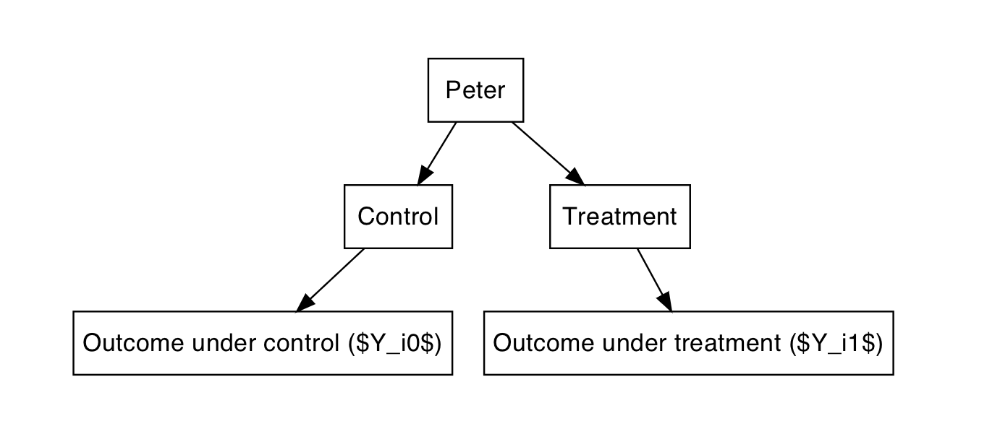

## Rationale

1. Theoretical foundations 
    - Understanding Causal Inference
    - Understanding CJ design
2. Technical skills 
    - Designing 
    - Deploying 
    - Analysing
    - Learning by doing (in R, in Qualtrics...)

## Sessions

1. Experimental design and causality
    - Causal Inference
    - Intro to CJ (if time)
2. The basics of conjoint experiments 
    - Terminology
    - Designing CJ 
    - Conjointsdt (Py3) and design
    - Different types of design  (if time)
3. Deploying, Collecting, Analysis
    - Different types of design 
    - Web survey methodology
    - Qualtrics implementations
    - Data Collection guidelines
    - AMCEs (if time) 
3. Analysing CJ data
    - AMCE 
    - Robustness checks
    - Marginal means (if time)
5. More advanced topics and conclusions
    - Marginal means 
    - Modelling restricted randomization
    - Modelling non-uniform Distributions
    - Power Analysis 
    - Conjoint Mixture Model

## About me: Alberto 

- FWO PhD Fellow at KU Leuven, Belgium
- Previously…
    - MA at Central European University 
- My research:
    - Radial Beliefs
    - Polarization
    - Liberal Values
    - Methods: Causality, experimental and semi-experimental design, SEM etc.
- Contact: alberto.stefanelli@kuleuven.be
- Website: www.albertostefanelli.com
- Twitter: `@sergsagara`


## Your turn 

- Name?
- Affiliation?
- Research interests?
- Previous experience with experimental designs?
- Previous experience with R?
- Previous experience with Qualtrics?
- Why are you taking this workshop?


## Materials

- Lecture's PDFs
- Labs
- Exercises
- Solutions 

Where to find the material:

- On my [GitHub/conjoint_class](https://albertostefanelli.github.io/conjoint_class/)

## Reading list {.allowframebreaks} 

**Recommended:**

- Imbens, Guido W, and Donald B Rubin (2015). Causal Inference for Statistics, Social, and Biomedical Sciences: An Introduction'. Cambridge University Press [Chapter 1]
- Morton, R.B. & Williams, K. (2010). Experimental Political Science and the Study of Causality: From Nature to the Lab. Cambridge University Press [Chapters 2 and 7]
- Kaczmirek, L. (2015). Conducting web surveys: Overview and introduction. In Engel, Uwe, et al., eds. Improving survey methods: Lessons from recent research. Routledge [Chapter 13]
- Knudsen, E., & Johannesson, M. P. (2018). Beyond the Limits of Survey Experiments: How Conjoint Designs Advance Causal Inference in Political Communication Research Political Communication, 0(0), 1–13
- Hainmueller, J., & Hopkins, D. J. (2015). The Hidden American Immigration Consensus: A Conjoint Analysis of Attitudes toward Immigrants. American Journal of Political Science, 59(3), 529–548
- Hainmueller, J., Hangartner, D., & Yamamoto, T. (2015). Validating vignette and conjoint survey experiments against real-world behavior. Proceedings of the National Academy of Sciences, 112(8), 2395–2400 
- Horiuchi, Yusaku, Daniel M Smith and Teppei Yamamoto. 2015. Measuring Voters’ Multidimensional Policy Preferences with Conjoint Analysis: Application to Japan’s 2014 Election. Available at SSRN 2627907
- Leeper, T. J., Hobolt, S. B., & Tilley, J. (2018). Measuring Subgroup Preferences in Conjoint Experiments  Political Analysis 55

## Before Starting

- Make sure to have access to the Qualtrics account
- **If something is unclear, ask : )**    

## Causal Inference (1)

For *statistical* models to produce valuable insight, they require additional *causal* models

- You need a scientific model that explains how entities influence other entities and not vice-versa.
- The reasons for a statistical model (or analysis) are *not in the data* bur rather in the *causes* of the data. 
    - The causes of the data cannot be extracted from the data itself: *"No causes in, no causes out"* (Nancy Cartwright).
    
## Causal Inference (2)

\centering

```{r ,echo=FALSE, out.width="70%",fig.show='hold',fig.align='centre'}


```

## What is Causal Inference (1)

::: columns

:::: column

- An attempt to understand the underlying causal model.  
- More than an association between variables.
- 2 different ways of seeing it 
    - Causal inference is prediction of an intervention 
    - Causal inference is imputation of missing observations  
    
::::

:::: column

\centering

```{r ,echo=FALSE, out.width="70%",fig.show='hold',fig.align='centre'}


```

::::

:::

## Causal prediction

::: columns

:::: column

- Prediction and causal inference are *very different*.
- But causal inference can be seen as a special kind of prediction.
- Knowing a cause means being able to *predict* the impact of intervening in a system. 
- What if I do this?

::::

:::: column

\centering

```{r ,echo=FALSE, out.width="70%",fig.show='hold',fig.align='centre'}
knitr::include_graphics("images/trees_blowing.jpg")

```

::::

:::

## Causal imputation

::: columns

:::: column

- Causal inference can be seen as a special way of dealing with missing data.
- Knowing a cause means being able to construct *counterfactual outcomes*.
- If you understand the cause of a phenomena, you would understand the consequences of its changes.
- What would have happen if I had done this instead of that?

::::

:::: column

\centering
\vspace{1cm}
\vspace{1cm}

```{r ,echo=FALSE, out.width="70%", fig.show='hold',fig.align='centre'}


```

::::

:::

## Potential outcomes framework (1)

1. Unit exposed to treatment could have been exposed to control
2. Each unit (individual) has two potential outcomes
  - $Y_0(x_i)$ is the potential outcome had the unit not been treated: "outcome under control"
  - $Y_1(x_i)$ is the potential outcome had the unit been treated: "outcome under treatment"

\centering

```{r ,echo=FALSE, out.width="70%",fig.show='hold',fig.align='centre'}


```

## Potential outcomes framework (2)

1. Causality tied to an intervention applied to unit at particular point in time (Imbens and Rubin 2015, 4)
2. Units can not receive both treatment and control (i.e., all values of treatment variable). This is called the "fundamental problem of causal inference" meaning that we only ever observe one of the two outcomes.
3. Estimation requires filling in/replacing the missing counterfactual
4. Solution? The average difference in the pair of potential outcomes averaged over the entire population of interest (at a particular moment in time)

\centering

```{r ,echo=FALSE, out.width="70%",fig.show='hold',fig.align='centre'}


```


## Causal analysis: Identification (1)

Social reality is complex. An outcome can be a cause of many other effects

- This is called equifinality. 
- It is what Hume (1772) summaries in the **billiard ball example.** 
- "Fail to ascertain how and why such causal effects arise" [@imai_unpacking_2011, p. 3]

\centering

```{r ,echo=FALSE, out.width="50%",fig.show='hold',fig.align='centre'}


```

## Causal analysis: Identification (2)

<!-- 1. Q: At age 40 both Cory and Janneke have an income (Y) of 3000 Euros. How can this be an example for equifinality? -->

1. Intervening mediating variables can make the process difficult to identify  [@imai_unpacking_2011]
2. "The Slave Trade and the Origins of Mistrust in Africa" [@nunn_slave_2011]. 
    - Unit/Unit of analysis = countries
    - Treatment: Slave Trade (1400-1900) [Observation]
    - Outcome: Present-day levels of Trust (2005) [Observation]
    - Theory: "[W]hy we expect to find evidence of increased mistrust among the descendants of those exposed to the slave trade 100 years after its end. […] individuals inherit norms of cooperation from their parents and make political choices (through voting) that determine the quality of domestic institutions. Through this mechanism, norms of cooperation will affect the equilibrium quality of domestic institutions. When there is a negative shock to internal norms of cooperation, the next generation will not only be less trusting, but also will choose institutions with weaker enforcement, resulting in poor behavior and low levels of trust among future generations" (pp. 3226)
3. The longer the time gap between treatment and outcome
    - the more fuzzy the theory (causal chain).
    - the more likely something else, unrelated happened in between.

## Causal analysis: Exercise (2)

1. "Republic should pray for rain" [@gomez_republicans_2007]
2. Weather -> Outcome of 1960 and 2000 presidential elections
3. Weather -> voter turnout -> republican vote 

- Q: Describe the process for a single person as concretely as possible (think in counterfactual terms)
- Q: Why is there a difference between Republicans and Democrats?
- Q: Are there intervening variables?

## Causal Analysis: Manipulation (1)

1. Example of the causes in the social sciences
    - Income
    - Social class
    - Exposure to political news/information
    - Education
    - Genes
    - Personality traits
    - Gender
    - Ethnic background
    - Exposure to particular policy intervention
2. Q: The outcome is the exam result: What is the difference between the “causes” in the following examples?
    - She did well on the exam because she is a woman.
    - She did well on the exam because she studied for it.
    - She did well on the exam because she was properly coached by her teacher.

## Causal Analysis: Manipulation (2)

1. **"No causation WITHOUT manipulation"**
    1. "Causes are only those things that could, in principle, be treatments in experiment" [@holland_statistics_1986, p.954]
    2. "Causes are experiences that units undergo and not attributes that they possess" [@holland_statistics_1986, p.954]

## Causal inference: Summary

1. In broader terms, causality is a connection of phenomena that connects one element (the cause) with another elements (effect/outcome/response)
    - it is a **process**. The 1st element of this process is responsible for 2nd and the 2nd dependent on the 1st.
    - causality is temporally bound. The cause(s) must precede the effect and **all lie in its past.**
2. The "fundamental problem of causal inference"
    - We only ever observe one of the two outcomes.
    - We need to relay on assumptions to estimate the causal effect 
3. **No causation without manipulation**. 
    - Avoid to elevate to the status of 'cause' attributes that cannot be, in principle, manipulated (e.g., race and ethnicity, for a discussion see @vanderweele_causal_2014)
2. Terminology (many terms that refer to same phenomena)
    - causality = causation = cause and effect = causal mechanism
    - treatment = cause = treatment and control groups = pre-treatment post-treatment
    - outcomes/response = effect


## References {.allowframebreaks} 

