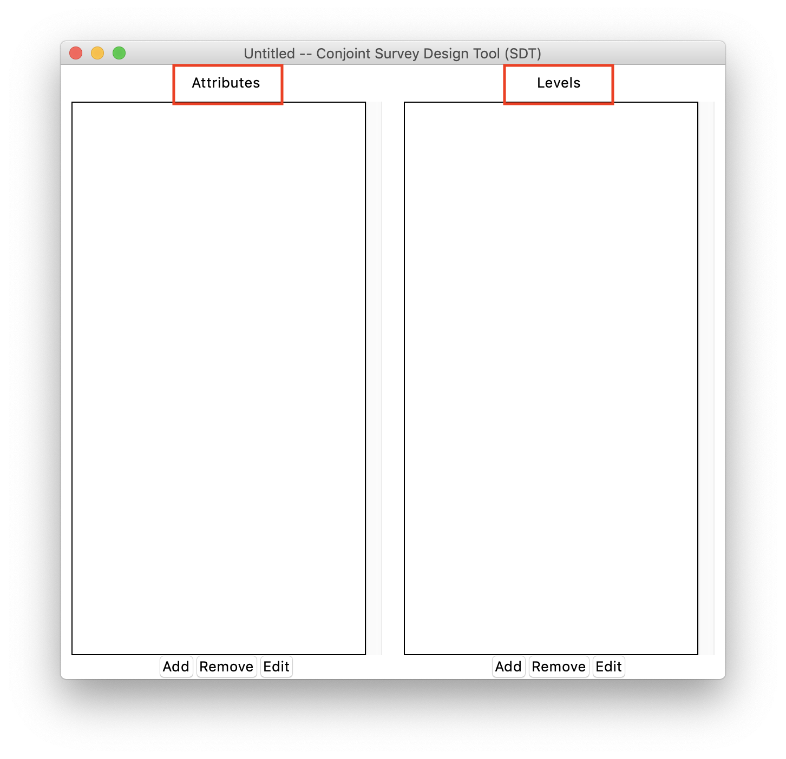
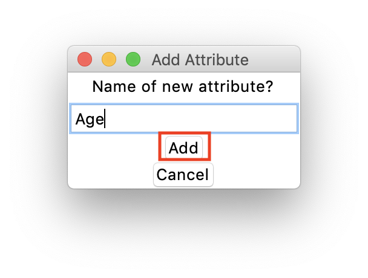
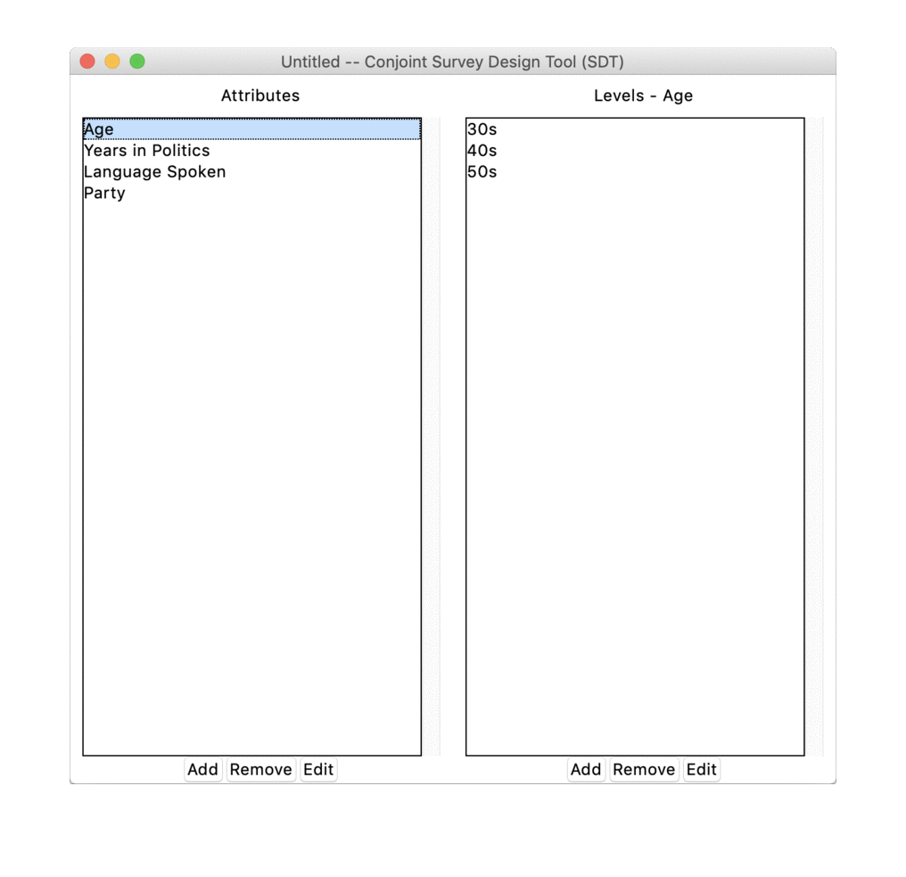
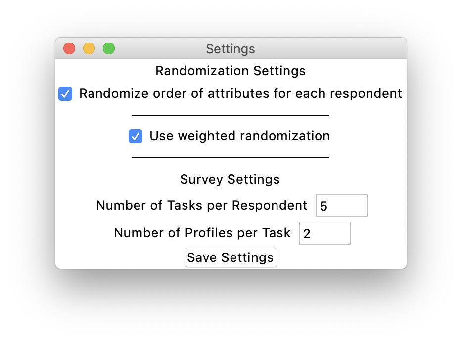
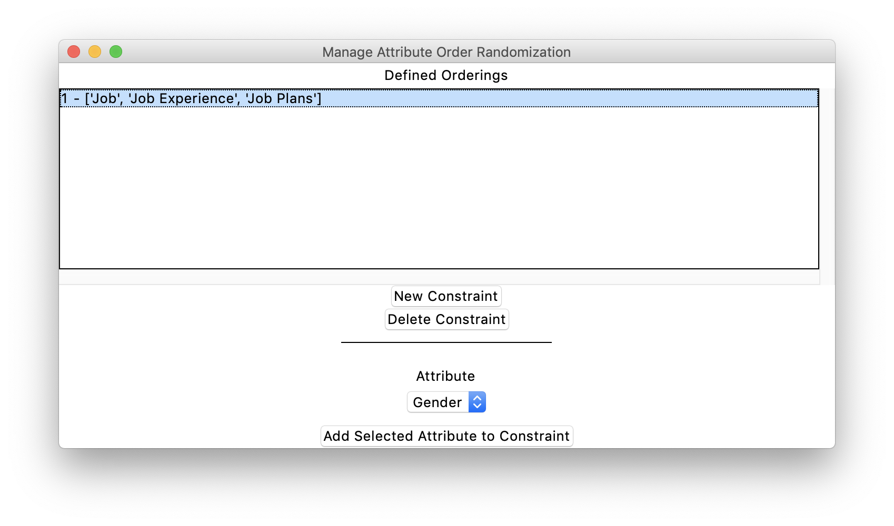
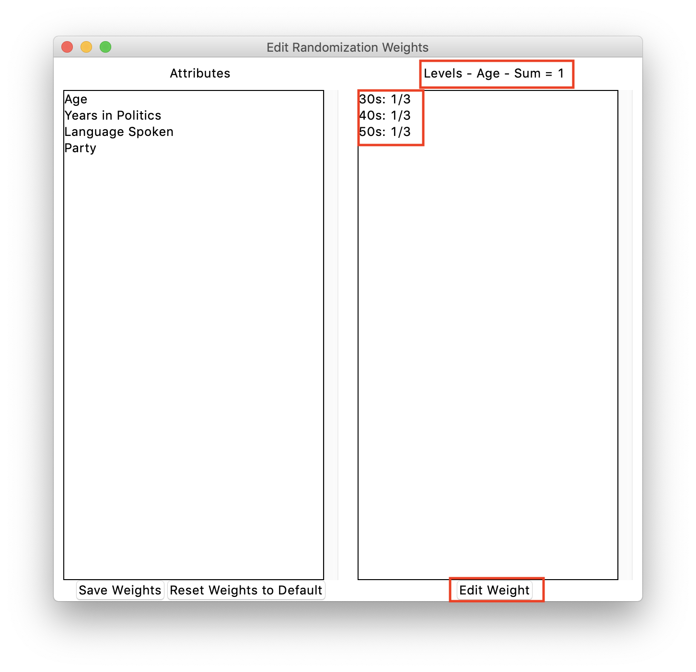
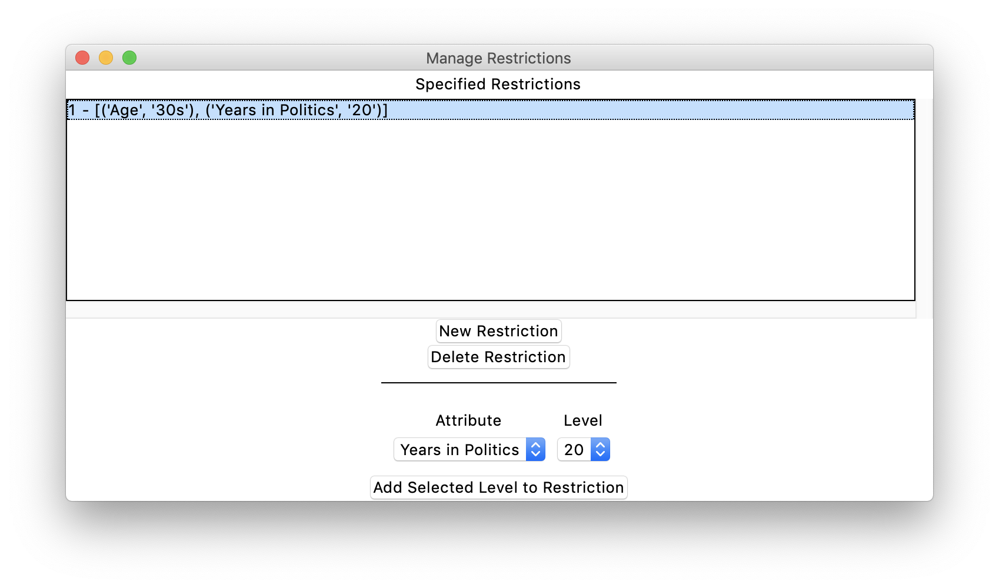

<style type="text/css">
#content {
    max-width: 1500px !important;
/*    !margin-left: 300px !important;
*/
}
#table-of-contents {
    width: 300px !important;
}

#postamble {
  font-size: 10px;
}

pre{
  background-color: #FFFFFF;
    font-size: 12px;
}
pre:not([class]) {
  background-color: #D8D8D8;
    color: black;
}

</style>

```{r global_options, include=FALSE}
knitr::opts_chunk$set(tidy=FALSE, 
  fig.show = 'hold', 
  fig.align = "center", 
  warning = FALSE, 
  message = FALSE, 
  comment = '')
options(width = 300, scipen = 9999)

# last dev version is needed for rmdformats.
# fixed these two
# more info https://github.com/juba/rmdformats/issues/92 
# more info https://github.com/juba/rmdformats/issues/93
# devtools::install_github("juba/rmdformats")

```

# Conjoint SDT 

1. We use a python program developed by Anton Strezhnev (NYU) called **Conjointsdt**
2. Deals with several aspects of out CJ design 
    - PHP script for randomization (external server)
    - JS script for randomization (only for Qualtrics)
    - Qualtrics HTML Tables  
    - The survey design in R (in fact, it does not)

# Attributes and Levels in Conjointsdt

```{r ,echo=FALSE, out.width="49%",fig.cap="",fig.show='hold',fig.align='centre'}



```

# Save the baseline design

```{r ,echo=FALSE, out.width="80%",fig.cap="",fig.show='hold',fig.align='centre'}
if (knitr:::is_latex_output()) {
  knitr::asis_output('\\url{....}')
} else {
  
}
```

1. Always save the design in case something get lost 
2. File -> Save -> name_of_the_design.sdt 

# Choice-set  

1. Edit -> Settings
1. Randomized Order of attributes per each respondent 
    - That is, we keep the attribute order the same per each respondent 
    - Ease the cognitive load 
2. Use Weighted Randomization 
    - Allow the usage of a specific marginal distribution for the levels 
3. Number of Tasks 
    - How many times a single respondents performs a CJ 
4. Number of Profiles
    - Usually two Profile at time 
    - Q: Can you think of a design where 3 profiles make sense?

```{r ,echo=FALSE, out.width="80%",fig.cap="",fig.show='hold',fig.align='centre'}


```

# Attribute order [Advanced]

1. Group together similar Attributes (e.g. all attributes related to Job in @hainmueller_causal_2014)
1. Usually, used in big designs to reduce the cognitive burden of the respondent 
1. Edit -> Restrictions -> Attribute Order Constrains

```{r ,echo=FALSE, out.width="80%",fig.cap="",fig.show='hold',fig.align='centre'}


```


# Weights for different distribution of the attributes/level [Advanced]

1. File -> Randomization Weights 
2. Impute the proportion from 0 to 1 
3. If a levels appear 20% of the time, 0.20 
4. **The sum of the weights should be equal to 1**
5. Rememberer to save: File -> Save -> name_of_the_design.sdt 

## Weights in Conjointsdt

```{r ,echo=FALSE, out.width="70%",fig.cap="",fig.show='hold',fig.align='centre'}


```

# Implement randomization restrictions [Advanced]

1. Q: Is it realistic that a candidate in its 30s has 20 years of political experience?
2. Set the conditional probability of displaying Age=30 AND Experience=20 equal to 0
3. Edit -> Restrictions -> Add Selected levels to Restriction
4. Rememberer to save: File -> Save -> name_of_the_design.sdt 

```{r ,echo=FALSE, out.width="80%",fig.cap="",fig.show='hold',fig.align='centre'}


```

# Exporting  

1. Menu -> Edit -> Export to PHP
    - This is going to be on a server for the randomization
    - php_script_name_of_the_design.php
2. Menu -> Edit -> Export to Java Script
    - This is going to be directly on Qualtrics
    - php_script_name_of_the_design.js
3. Menu -> Edit -> Export to Qualtrics 
    - HTML tables that will be fed by the PHP/JS 
    - Task_1_name_of_the_design.html
4. Menu -> Edit -> Export to R
    - Used in the Modelling Part
    - design_R_name_of_the_design.dat