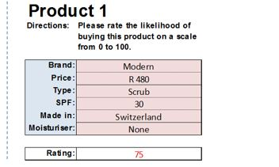
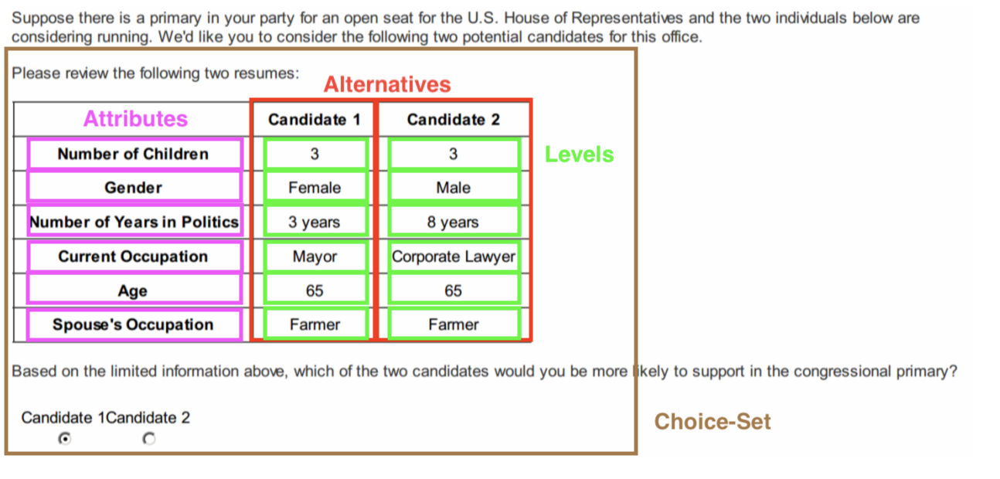

## Session 1: Recap 

1. In broader terms, causality is a connection of phenomena that connects one element (the cause) with another elements (effect/outcome/response)
    - it is a **process**. The 1st element of this process is responsible for 2nd and the 2nd dependent on the 1st.
    - causality is temporally bound. The cause(s) must precede the effect and **all lie in its past.**
2. The "fundamental problem of causal inference"
    - We only ever observe one of the two outcomes.
    - We need to relay on assumptions to estimate the causal effect 
3. **No causation without manipulation**. 
    - Avoid to elevate to the status of 'cause' attributes that cannot be, in principle, manipulated
    
## Materials

- Lecture's PDF
- Lab
- Exercise

Where to find the material:

- On my [GitHub/conjoint_class](https://albertostefanelli.github.io/conjoint_class/)

## What is a conjoint experiment 

1. **Substantively:** An instrument to understand peoples' choices
2. **Technically:**  A (factorial) survey experiment designed to measure (underlying) preferences
    1. Whether showing one attribute as opposed to another would change the respondent’s choice
    2. E.g., why do voters choose one party, candidate, or policy over another? 
3. It deals with options that simultaneously vary across two or more attributes (**multi-dimensionality**)
4. As such, involves trade-offs (e.g., Male Republican VS Female Democrat)
    1. The possibility that option A (Donald Trump) is better than option B (Hilary Clinton) on attribute Gender (Male) while B is better than A on attribute PID (Democrat). 

## How a CJ looks like?

```{r ,echo=FALSE, out.width="90%",fig.cap="",fig.show='hold',fig.align='centre'}
knitr::include_graphics("images/conjoint_teele.png")

```

1. Q: What the causal process involves?
2. Q: What are we manipulating in this example? (**No Causation without manipulation.**)

## Limitations of traditional observational studies

1. Respondent’s preferences are measured without putting them in a broader context
    1. Answers to survey questions can fluctuate considerably depending on how the questions are asked [@kahneman_judgment_1982].
    2. E.g. a voter may evaluate a particular policy position differently depending on the other policies bundled in a given party platform.
2. Separation of priority ranking and preference intensity. In actual decisions, these two steps are inseparably connected in respondents’ minds. 
    1. E.g., voting is both preference towards a party/candidate and intensity of such preference
3. Causal identification and causal ordering is difficult (or almost impossible)
    1. Q: Does ideological proximity cause vote choice or is the other way around? 

## Why CJ are relevant for causal analysis?

They go beyond the simple cause-and-effect relationship between a single binary treatment and an outcome variable. 

1. Evaluate the relative explanatory power of different theories, moving beyond tests of a single hypothesis
    1. Analysis of more complex causal questions
    2. E.g., is ideology or party identification that drive vote choice ?
    3. Relatively cheap and fast to implement 
2. Display high(er) levels of validity 
    1. External validity: CJs effectively approximate real-world outcomes [@hainmueller_validating_2015; @auerbach_how_2018]
    2. Internal Validity: CJs enhance realism relative to the direct elicitation of preferences on a single dimension 
    2. Measurement quality: respondents are found to be consistent even for quite complex tasks [e.g., @bansak_beyond_2019]
3. Reduce social desirability biases such as vote for female (vs male) political candidates [e.g., @teele_ties_2018] or opposition to social housing in respondent’s neighbourhood [e.g., @hankinson_when_2018].
4. Good prediction device that can provide insights into practical problems such as policy design and implementation.


# Different CJ designs  

## Rating (scales) (1)

::: columns

:::: column

1. It usually involves only one profile at the time
2. As such, no trade-off between attributes
3. Similar to vignette studies 
    
::::

:::: column

\centering

```{r ,echo=FALSE, out.width="100%",fig.show='hold',fig.align='centre'}


```

::::

:::

## Rating (scales) (2)

1. PRO: easy to execute, implement, and model 
2. CON: no trade-offs as it often occurs in real choice settings 
3. CON: often no clear differentiation between profiles 
4. CON: interpretation might be difficult in certain situation
    1. what liking a candidate actually means?
    2. does liking a candidate would imply that people would actually vote for that candidate? 


## Ranking (1)

::: columns

:::: column

1. It involves more than one profile at the time
2. As such, trade-offs are easier to see
3. Clear differentiation between most-preferred and least-preferred profiles if low number of choices
    
::::

:::: column

\centering

```{r ,echo=FALSE, out.width="100%",fig.show='hold',fig.align='centre'}


```

::::

:::

## Ranking (2)

1. PRO: easy to execute, implement, and model 
2. CON: causal interpretation might be difficult due to mid ranks 
    1. What is the difference between the 6th and the 5th candidate in a 15 candidates rank conjoint
    2. Does the ranking a candidate first would imply that people would actually vote for that candidate? 
3. CON: often increase measurement error since ranking is not an easy task [@boyle_comparison_2001]

## Choice Based (1)

2. “The most widely used flavour of conjoint analysis” [@sawtooth_software_sawtooth_2008]
1. Revealed Preference (RP): real life choices 
    - Clear validity advantages [@diamond_contingent_1994]
    - E.g., which insurance plan peoples have chosen after having compared several different offers
2. **Stated Preference (SP):** experimental setting where we ask respondents **what would they do** instead of observing what they have done
    - E.g., what type of insurance plan people **would choose** after having compared several different offers
    - Can be used to assess the choice decision in an hypothetical or future scenario (relevant for policy implementation)
    - However, what people say in surveys can diverge from what they would do in actual decisions


## Choice (2)

\centering

```{r ,echo=FALSE, out.width="100%",fig.show='hold',fig.align='centre'}
knitr::include_graphics("images/conjoint_teele.png")

```


## Choice Based (3)

1. PRO: High(er) external validity 
    1. Trade-off between 2 or 3 profiles is more natural and close to real-life choice scenarios 
2. PRO: Quite easy modelling approaches 
3. PRO: Context manipulations are easy to implement 
    1. E.g., priming respondents with certain informations 
2. CON: Careful experimental design 
3. CON: Can be difficult to set up 

## Other designs

1. Point allocation 
2. Adaptive Conjoint 
    1. Adaptive choice-sets based on respondent's characteristics, preferences or attitudes
    2. E.g., in the choice of transport mode, the choice set of an individual without driving license and/or car should not include the alternative "car" 
    3. More complex adaptive designs that involve algorithms to cluster individuals based on their underlying preferences 
2. Combination of previous design 
  1. E.g., rating with choice based
  2. E.g., ranking conjoint with an adaptive design 

## Terminology Choice-based CJ (1)

1. Alternatives
    1. The two (or more) profiles that a respondent will have to choose from (e.g., Candidate A VS Candidate B)
2. Attributes 
    1. Independent variables, explanatory variables, treatments, features 
    1. Characteristics of the different alternatives (e.g, age, gender of the proposed candidates)
3. Levels (of the attributes)
    1. The discrete values that an attribute can take(e.g., Age: 20, 30, 40, 50) 
4. Choice-sets: a combination of two or more alternatives (e.g., only progressive candidates VS only conservative candidates)
    1. Relevant if we want to analyse a subset of the profiles (e.g., only female candidates) 

## Terminology in Choice-based CJ (2)

```{r ,echo=FALSE, out.width="100%",fig.cap="",fig.show='hold',fig.align='centre'}


```

Q: What the research is controlling (and manipulating) and what not?

# The challenge of experimental design

## Why a challenge?

- Why is it called design? 
    1. Manipulation of the treatment conditions occurs **by design** 
    2. That is, the researcher controls the specific treatment conditions
- Design is the most relevant elements of any experiment approach and the greater barrier in answering your research question 
- It allow us to understand the decision rules used to select a profile instead of another 

## Design charateristics in a CJ

1. **Feature Design**
    1. Attributes
    2. Levels 
2. **Choice-Set Design**
    1. Conjoint profiles
3. **Information/Context Design**
    1. Priming, framing .... 
    2. E.g. information acceleration processes, elaboration tasks, information sources

## Feature Design: attributes 

1. Identify and define the **attributes**   
    1. Which attributes should be included in order to answer my RQ?
    2. Define a universal but finite list of attributes that are theoretically relevant
        1. Usually 10-15 attributes
    3. Reduce the attributes
        1. Less then 10 attributes is considered acceptable 
    4. Avoid double-barrel attributes 
        1. E.g., "Expertise" of a candidate
        2. Q: can you think of another example?

## Feature Design: levels

1. Identify and define the **levels**   
    1. Which levels are suitable for the decision task?
    2. Are the levels ordinal, nominal or continuous?
    3. Select theoretically relevant start- and end-points for each attributes
        1. Q: What is a sensible range for the age of a candidate?
    2. Define a finite list of levels that have discriminant power.
        1. From 2 to maximum 8  
        1. Q: What age levels should we include for a candidate?
        1. Q: Does a year difference make any difference in accuracy? 
    3. If the design is too big and you assume linearity, use only start- and end-point designs 
        1. e.g., Instead of ordinal age use "Young" and "Old"
    4. Avoid attributes ambiguity 
        1. E.g., "High level of integrity" of a candidate VS "Never committed for corruption"  

## Attributes Design: Garbage in Garbage out {.allowframebreaks} 

1. Internal Validity: **garbage in, garbage out"**
    1. **Masking** or inter-attributes correlation [@verlegh_range_2002]
        1. Perceived association between an attribute included in the design and an omitted one
        1. E.g. Including policy positions but excluding PID 
    2. **Satisficing** [@bansak_beyond_2019]
        1. Disregard substantive informations due to high cognitive complexity. 
        2. E.g., inferring from PID policy positions and attributes 
    3. Unrealistic trade-off(s) between attributes
        1. A doctor (Attribute: Profession) without an academic degree (Attribute: Education)
    4. **“Range effect”** [@verlegh_range_2002]
        1. Using specific level combinations could lead to implicit associations 
        2. E.g., a white Democratic candidate of age 78 from Vermont
2. External Validity: **“Number-of-levels effect”**
        1. Too many levels could make the interpretation difficult 
        2. Statistical power might be insufficient 

## Choice-Set Design: Profiles, Tasks, Outcome

1. Number of Alternative **Profiles**
    1. Single Profiles (1)
    2. Paired Profiles (2) 
    4. Multi Profiles (up to 4)
2. Number of conjoint choice **Tasks** per respondent 
    1. From 2 to no more than 20
3. **Outcome** measures 
    1. Discreet Choice (better for trade-offs)
    2. Individual rating (better for detecting extreme response style)
4. **Randomization**
    1. Position of the attributes in our CJ 
    
## Choice-Set Design: Sample size and complexity 

1. Sample size = Number of choices per individual (tasks) X Number of participant in the study (N) X Number of profiles
    - Trade off between statistical power and fatigue 
2. Design Complexity = Number of Attributes X Number of Attributes' Levels X Number of Profiles 
    - It is a trade-off between cognitive burden and experimental conditions
3. Data quality = Power (Sample size) - Design Complexity - Cognitive Burden

## Conjoint Design: Summary

1. Conjoint experiments are experimental design to measure (underlying) preferences
    - Whether a respondents prefer one attribute as opposed to another when choosing a profile 
2. Advantages
    - Analysis of more complex causal questions
    - Good external and internal validity 
3. Different designs
    - Rating 
    - Ranking 
    - Choice (most used)
4. Terminology
    - Attributes: characteristics of the profile
    - Levels: characteristics of the different attributes
5. Garbage in Garbage out
    - Clarity in the attributes/levels
    - Design Complexity
    - Fatigue
    - Cognitive Burden
    
## References {.allowframebreaks} 

