<style type="text/css">
#content {
    max-width: 1500px !important;
/*    !margin-left: 300px !important;
*/
}
#table-of-contents {
    width: 300px !important;
}

#postamble {
  font-size: 10px;
}

pre{
  background-color: #FFFFFF;
    font-size: 12px;
}
pre:not([class]) {
  background-color: #D8D8D8;
    color: black;
}

</style>

```{r global_options, include=FALSE}
knitr::opts_chunk$set(tidy=FALSE, 
  fig.show = 'hold', 
  fig.align = "center", 
  warning = FALSE, 
  message = FALSE, 
  comment = '')
options(width = 300, scipen = 9999)

# last dev version is needed for rmdformats.
# fixed these two
# more info https://github.com/juba/rmdformats/issues/92 
# more info https://github.com/juba/rmdformats/issues/93
# devtools::install_github("juba/rmdformats")

```

# Why Qualtrics 

1. Quite flexible  
2. Does not require (much) programming 
3. Excellent support 
4. Widely used in Academia 
5. Widely used by survey companies 
6. Other options are not there yet 
    - Check out Lime Survey if are willing to learn JS. 
    
# Getting started: Create a sruvey

1. Create an account
2. Create a new survey 
    - Create new Project -> Survey 
    - Project Name  -> Import OR Create a blank Project

```{r ,echo=FALSE, out.width="49%",fig.cap="",fig.show='hold',fig.align='centre'}
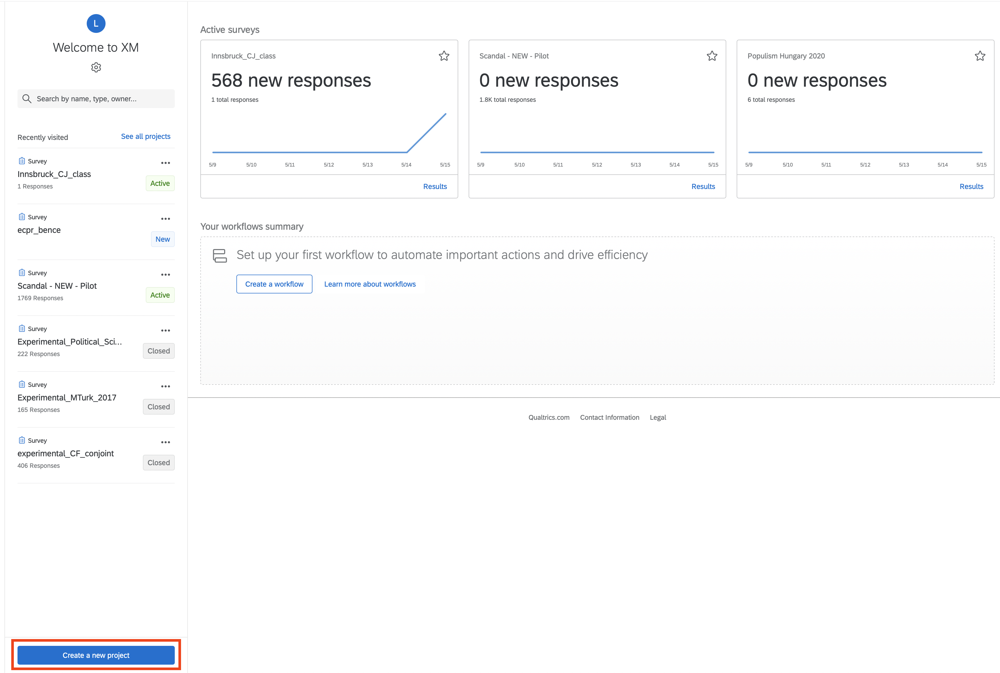
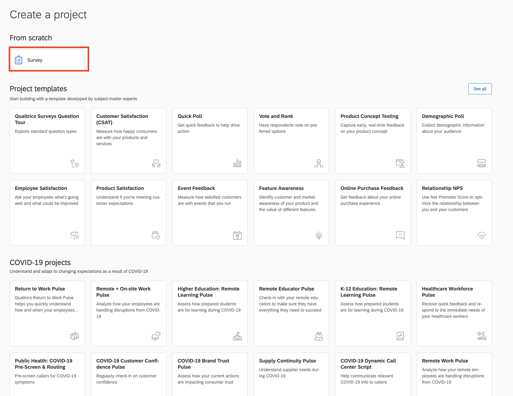
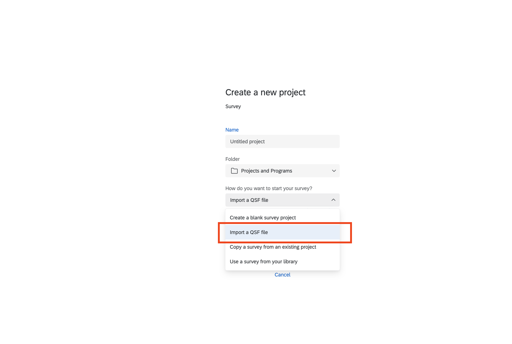


```

# Adding Questions

1. Organize the survey in blocks 
    1. Changing block means changing page
    2. Each block should correspond to a part of the survey (Demographics, Controls, Experiments...)
2. Insert questions in each blocks
    1. Click on each block to add text and change options 
    2. Use the right panel to modify the type of questions and their behaviour 
    3. Use the left panel for the randomization of the questions' options 
    
```{r ,echo=FALSE, out.width="49%",fig.cap="",fig.show='hold',fig.align='centre'}
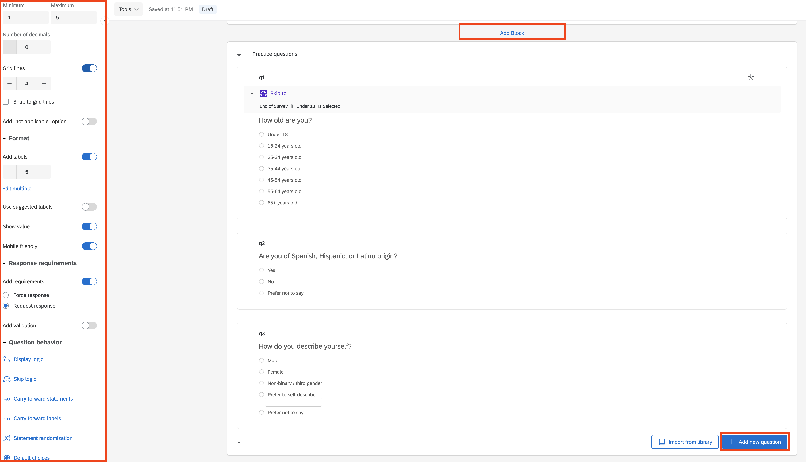

```


# CJ Block: HTML Table 

1. Open the .html generated using Conjointdt file using a text editor 
    1. textEdit on Mac
    2. notepad on Windows
    3. Sublime
2. Modify according to your needs

## CJ Block: Qualtrics 

2. On Qualtrics: Create a new multiple choice question
3. On the text area select "HTML View"
4. Copy the content of each .html file generated by Conjointsdt
5. Modify the text if necessary 
6. Add a binary Multiple Choice Options (e.g. Candidate 1, Candidate 2)
    7. Validation Options ->  Request Choice 
    8. Position ->  Horizontal 
    9. Answer ->  Single Answer  
7. Insert a Page Break 
5. Repeat for all the CJ tasks  

## CJ Blocks: Image 

```{r ,echo=FALSE, out.width="80%",fig.cap="Conjointsdt Attributes and Levels",fig.show='hold',fig.align='centre'}
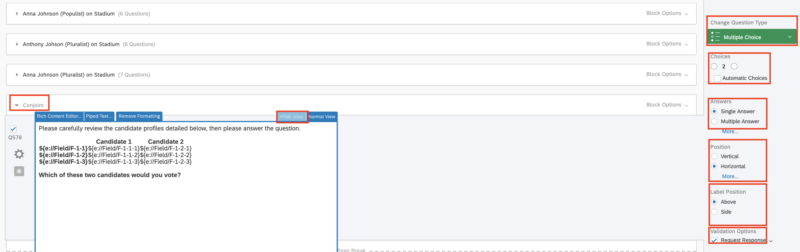

```

# Add Java Script 

1. Start by choosing a question that appears somewhere before the conjoint in the survey flow. 
    - It can be any question that appears to all respondents (e.g., the consent form, a demographic variable that is asked of all respondents).
2. Find the JavaScript console.
    - By default, Qualtrics pre-populates some functions
    - All of the JavaScript for the randomization goes inside the *Qualtrics.SurveyEngine.addOnload()* function, as indicated below:


```{r ,echo=FALSE, out.width="49%",fig.cap="",fig.show='hold',fig.align='centre'}
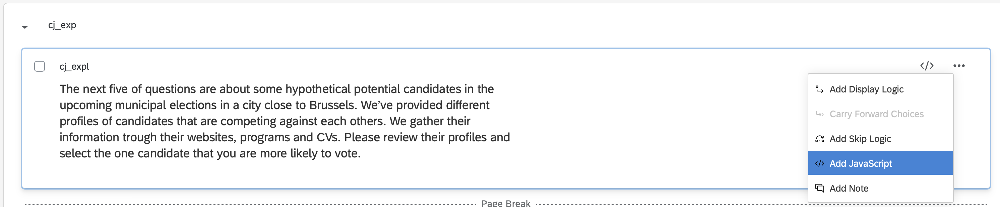

```


```{js, echo=TRUE, out.width="80%",fig.cap="",fig.show='hold',fig.align='centre', evaluate=FALSE}
Qualtrics.SurveyEngine.addOnload(function()
{
// Code to randomly generate conjoint profiles in a Qualtrics survey

// Terminology clarification: 
// Task = Set of choices presented to respondent in a single screen (i.e. pair of candidates)
// Profile = Single list of attributes in a given task (i.e. candidate)
// Attribute = Category characterized by a set of levels (i.e. education level)
// Level = Value that an attribute can take in a particular choice task (i.e. "no formal education")

// Attributes and Levels stored in a 2-dimensional Array 

/* Randomize array in-place using Durstenfeld shuffle algorithm */
function shuffleArray(array) {
    for (var i = array.length - 1; i > 0; i--) {
        var j = Math.floor(Math.random() * (i + 1));
        var temp = array[i];
        array[i] = array[j];
        array[j] = temp;
    }
    return(array);
}

// Function to generate weighted random numbers
function weighted_randomize(prob_array, at_key)
{
	var prob_list = prob_array[at_key];
	
	// Create an array containing cutpoints for randomization
	var cumul_prob = new Array(prob_list.length);
	var cumulative = 0.0;
	for (var i=0;  i < prob_list.length; i++){
		cumul_prob[i] = cumulative;
		cumulative = cumulative + parseFloat(prob_list[i]);
	}

	// Generate a uniform random floating point value between 0.0 and 1.0
	var unif_rand = Math.random();

	// Figure out which integer should be returned
	var outInt = 0;
	for (var k = 0; k < cumul_prob.length; k++){
		if (cumul_prob[k] <= unif_rand){
			outInt = k + 1;
		}
	}

	return(outInt);

}
                    

var featurearray = {"Campaign statement" : ["The political power should return to the people","Competent party leaders make the best decisions"],"Proposal" : ["Ban extreme groups rallies in the state capital","Rule by executive order if the opposite party does not collaborate","Ban intollerant speech against political minorities"],"Language Spoken" : ["French","Turkish","Italian","Portuguese","Dutch"],"Party" : ["PVDA (Radical-Left)","ECOLO (Greens)","PS (Left)","CDH (Liberals)","MR-VLD (Right)","N-VA (Radical Right)"]};

var restrictionarray = [[["Age","30s"],["Years in Politics","20"]]];

var probabilityarray = {};

// Indicator for whether weighted randomization should be enabled or not
var weighted = 0;

// K = Number of tasks displayed to the respondent
var K = 5;

// N = Number of profiles displayed in each task
var N = 2;

// num_attributes = Number of Attributes in the Array
var num_attributes = featurearray.length;

// Should duplicate profiles be rejected?
var noDuplicateProfiles = false;

var attrconstraintarray = [];

// Re-randomize the featurearray

// Place the $featurearray keys into a new array
var featureArrayKeys = Object.keys(featurearray);

// If order randomization constraints exist, drop all of the non-free attributes
if (attrconstraintarray.length != 0){
	for (const constraints of attrconstraintarray){
		if (constraints.length > 1){
			for (var p = 1; p < constraints.length; p++){
				if (featureArrayKeys.includes(constraints[p])){
					var remkey = featureArrayKeys.indexOf(constraints[p]);
                    featureArrayKeys.splice(remkey, 1);
				}
			}
		}
	}
} 

// Re-randomize the featurearray keys
featureArrayKeys = shuffleArray(featureArrayKeys);

// Re-insert the non-free attributes constrained by $attrconstraintarray
if (attrconstraintarray.length != 0){
	for (const constraints of attrconstraintarray){
		if (constraints.length > 1){
			var insertloc = constraints[0];
			if (featureArrayKeys.includes(insertloc)){
				var insert_block = [];
				for (var p = 1; p < constraints.length; p++){
          insert_block.push(constraints[p]);
				}
				var begin_index = featureArrayKeys.indexOf(insertloc);
				featureArrayKeys.splice(begin_index+1, 0, ...insert_block);
			}
		}
	}
}


// Re-generate the new $featurearray - label it $featureArrayNew
var featureArrayNew = {};
for (var h = 0; h < featureArrayKeys.length; h++){
    featureArrayNew[featureArrayKeys[h]] = featurearray[featureArrayKeys[h]];        
}


// Initialize the array returned to the user
// Naming Convention
// Level Name: F-[task number]-[profile number]-[attribute number]
// Attribute Name: F-[task number]-[attribute number]
// Example: F-1-3-2, Returns the level corresponding to Task 1, Profile 3, Attribute 2 
// F-3-3, Returns the attribute name corresponding to Task 3, Attribute 3

var returnarray = {};

// For each task $p
for(var p = 1; p <= K; p++){

	// For each profile $i
	for(var i = 1; i <= N; i++){

		// Repeat until non-restricted profile generated
		var complete = false;

		while (complete == false){

			// Create a count for $attributes to be incremented in the next loop
			var attr = 0;
			
			// Create a dictionary to hold profile's attributes
			var profile_dict = {};

			// For each attribute $attribute and level array $levels in task $p
			for(var q = 0; q < featureArrayKeys.length; q++){
				// Get Attribute name
				var attr_name = featureArrayKeys[q];
					
				// Increment attribute count
				attr = attr + 1;
	
				// Create key for attribute name
				var attr_key = "F-" + p + "-" + attr;
	
                // Store attribute name in returnarray
                returnarray[attr_key] = attr_name;

				// Get length of levels array
				var num_levels = featureArrayNew[attr_name].length;

				// Randomly select one of the level indices
				if (weighted == 1){
					var level_index = weighted_randomize(probabilityarray, attr_name) - 1;

				}else{
					var level_index = Math.floor(Math.random() * num_levels);
				}	

				// Pull out the selected level
				var chosen_level = featureArrayNew[attr_name][level_index];
				
				// Store selected level in profileDict
				profile_dict[attr_name] = chosen_level;
	
				// Create key for level in $returnarray
				var level_key = "F-" + p + "-" + i + "-" + attr;
	
				// Store selected level in $returnarray
				returnarray[level_key] = chosen_level;

			}

            var clear = true;
            
            // Cycle through restrictions to confirm/reject profile
            if (restrictionarray.length != 0){
                for (var v = 0; v < restrictionarray.length; v++){
                    var falsevar = 1;
                    for (var mp = 0; mp < restrictionarray[v].length; mp++){
                        if (profile_dict[restrictionarray[v][mp][0]] == restrictionarray[v][mp][1]){
                            falsevar = falsevar*1;
                        }else{
                            falsevar = falsevar*0;
                        }							
                    }
                    if (falsevar == 1){
                        clear = false;
                    }
                }
            }
                            
            // If we're throwing out duplicates
            if (noDuplicateProfiles == true){
                // Cycle through all previous profiles to confirm no identical profiles
                if (i > 1){    
                    // For each previous profile
                    for(var z = 1; z < i; z++){
    					
                        // Start by assuming it's the same
                        var identical = true;
    					
                        // Create a count for $attributes to be incremented in the next loop
                        var attrTemp = 0;
    					
                        // For each attribute $attribute and level array $levels in task $p
                        for(var qz = 0; qz < featureArrayKeys.length; qz++){
    						
                            // Increment attribute count
                            attrTemp = attrTemp + 1;
    
                            // Create keys 
                            var level_key_profile = "F-" + p + "-" + i + "-" + attrTemp;
                            var level_key_check = "F-" + p + "-" + z + "-" + attrTemp;
    						
                            // If attributes are different, declare not identical
                            if (returnarray[level_key_profile] != returnarray[level_key_check]){
                                identical = false;
                            }
                        }
                        // If we detect an identical profile, reject
                        if (identical == true){
                            clear = false;
                        }
                    }                
                }
            }
            complete = clear;
        }
    }
}
                            
// Write returnarray to Qualtrics

var returnarrayKeys = Object.keys(returnarray);

for (var pr = 0; pr < returnarrayKeys.length; pr++){
       Qualtrics.SurveyEngine.setEmbeddedData(returnarrayKeys[pr], returnarray[returnarrayKeys[pr]]); 
}


});

Qualtrics.SurveyEngine.addOnReady(function()
{
	/*Place your JavaScript here to run when the page is fully displayed*/

});

Qualtrics.SurveyEngine.addOnUnload(function()
{
	/*Place your JavaScript here to run when the page is unloaded*/

});
```

# Add Embedded content

1. This is needed to store the results of your randomization.
    - If you forget to do this, everything will still seem fine in Qualtrics but you **won’t be able to analyse the data**.
2. Click the ”survey flow” link in the upper-left corner of your Qualtrics screen.
3. Add a new embedded data element to it by clicking "add below" or "add a new element here".
4. Click and drag this element so that it is placed near the beginning of your survey. 
    - It **must be above** the question block that includes your randomization JavaScript. 
    - I usually put these at the very top of my survey flow.
5. Enter the same names from the conjoint tables
    - Leave the values blank.
    - This must be repeated for every conjoint task.
    

```{r ,echo=FALSE, out.width="49%",fig.cap="",fig.show='hold',fig.align='centre'}
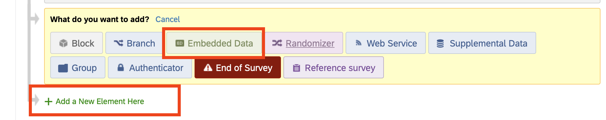
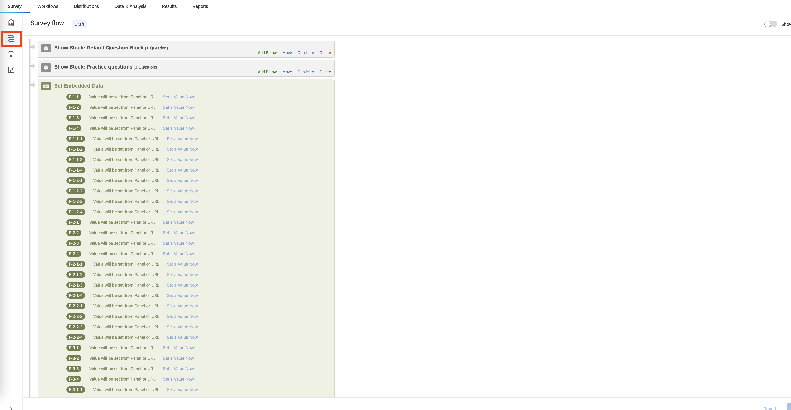


```

# Attention check

## Instructional Manipulation Checks (IMCs)

1. They should check whether a participant has paid attention to the question, not so much to the instructions above it
2. Participants must be explicitly instructed to complete a task in a certain way (e.g. 'click 'Strongly disagree' for this question')
3. No room for misinterpretation (e.g. 'Bird is a clothing brand. Do you agree?')
4. They must be easy to read (i.e., should not use small font, or have reduced visibility)

## A good example of an IMC 

```{r ,echo=FALSE, out.width="49%",fig.cap="",fig.show='hold',fig.align='centre'}
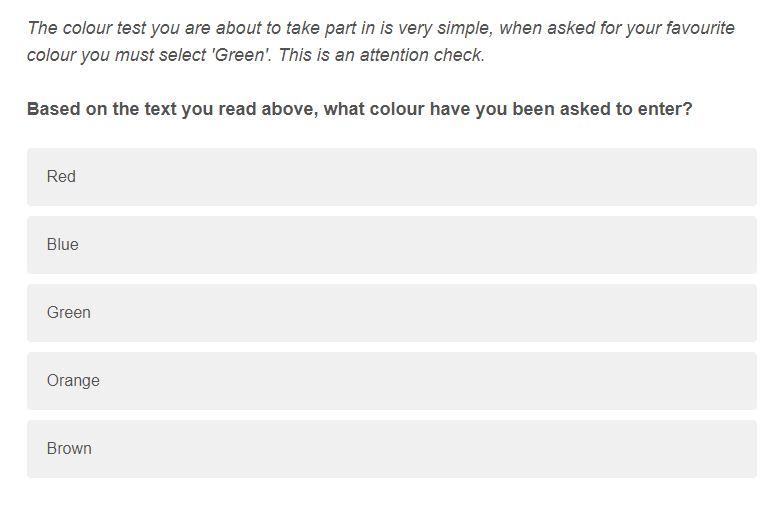


```

## A bad example of an IMC


```{r ,echo=FALSE, out.width="49%",fig.cap="",fig.show='hold',fig.align='centre'}
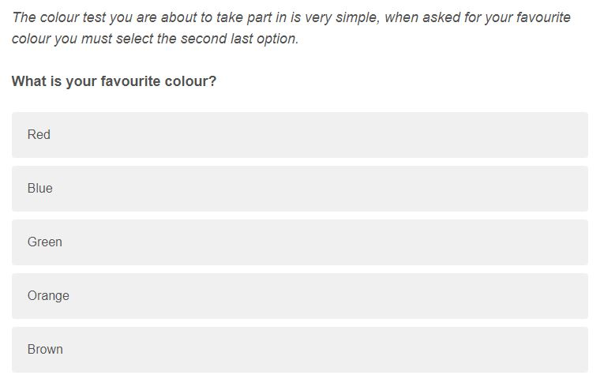


```

# Nonsensical Items

1. Use a scale response
2. No prior knowledge should be required
3. Participants should not be given a 'neutral' response option (i.e., no middle scale value)
4. Correct responses should either be extreme agreement or extreme disagreement, however any response indicating disagreement or agreement should be accepted
5. Participants who answer in the opposite manner to the objectively correct answer have failed

## A good example of a nonsensical item


```{r ,echo=FALSE, out.width="49%",fig.cap="",fig.show='hold',fig.align='centre'}
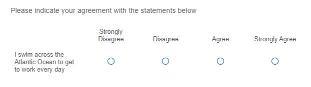


```


## A bad example of a nonsensical item

```{r ,echo=FALSE, out.width="49%",fig.cap="",fig.show='hold',fig.align='centre'}
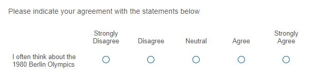


```

# Comprehension checks 

1. Participants must be free to re-read the key information at the time the comprehension check is presented
2. These checks cannot involve free-text responses
3. Comprehension checks should be given at the start of the study/experiment
4. If a participant fails a comprehension check twice then they should be excluded

## A good example of a nonsensical item

From @gordon_keeping_2019


```{r ,echo=FALSE, out.width="49%",fig.cap="",fig.show='hold',fig.align='centre'}
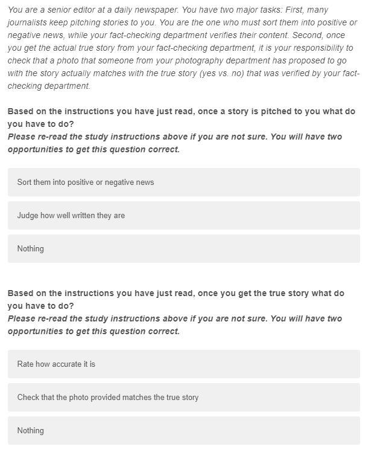


```


# Fraud Detection

## Prevent Multiple Submissions

1. Go to Survey options.
2. Go to Security.
3. Enable Prevent multiple submissions.
    1. End survey with a message: The respondent is sent out of the survey and we display an end of survey message. 
    2. Redirect to URL: Redirect respondent out of the survey to a URL. 
    3. Flag responses: Duplicate respondents will not be sent out of the survey, and will be allowed to finish their response. However, their responses will be assigned a value under the field Q_BallotBoxStuffing.
    
```{r ,echo=FALSE, out.width="49%",fig.cap="",fig.show='hold',fig.align='centre'}
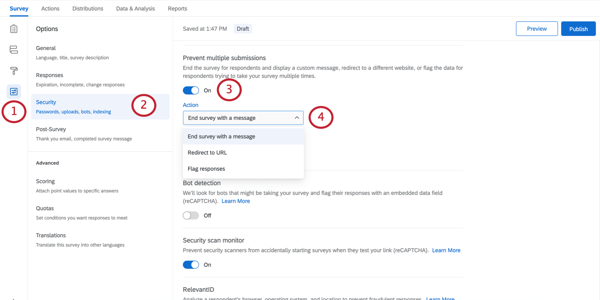

```
    
## Bot Detection

1. Go to Survey options.
2. Go to Security.
3. Enable Bot Detection.
4. This activates the field Q_RecaptchaScore, which uses Google’s invisible reCaptcha technology.

```{r ,echo=FALSE, out.width="49%",fig.cap="",fig.show='hold',fig.align='centre'}
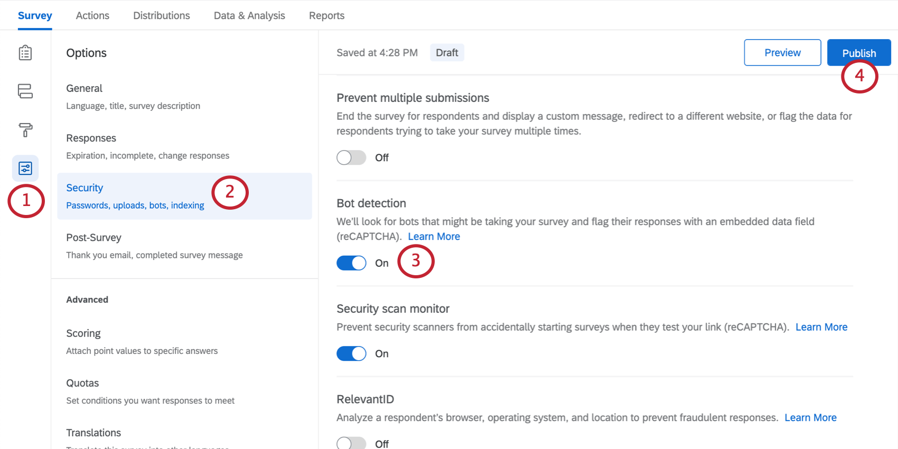

```

## Scraper Detection 

1. Go to Survey options.
2. Go to Security.
3. Enable Security Scan Monitor.
4. Prevent email scanning software from inadvertently starting a survey session when a survey link is included in the email.


```{r ,echo=FALSE, out.width="49%",fig.cap="",fig.show='hold',fig.align='centre'}
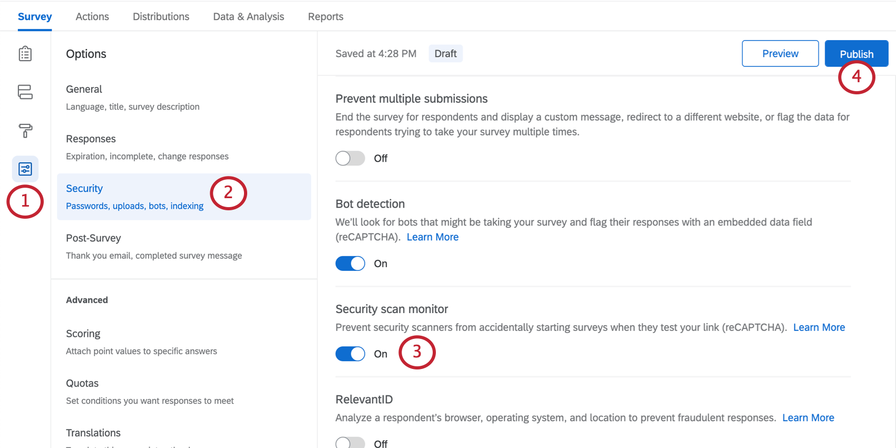

```


