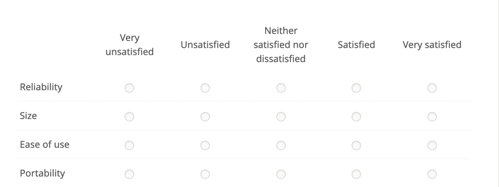

## Session 2: Recap 

1. Different CJ designs
    - Rating 
    - Ranking 
    - Choice (most used)
2. Terminology
    - Attributes: characteristics of the profile
    - Levels: characteristics of the different attributes
3. Garbage in, garbage out
    - Clarity in the attributes/levels
    - Design Complexity
    - Fatigue
    - Cognitive Burden
    
    
## Session 3: Outline 

1. Different CJ Randomization
    - Fully randomized uniform design
    - Randomized weighted design
    - Restricted Randomization (or nested design)
2. Assumptions 
    - SUTVA
    - No profile-order effects
    - Randomization of the profiles 
3. Designing a survey 
    - Designing good questions
    - Response options and placement
    - Motivate respondents 
    - Get feedbacks and pre-test 
4. On-line Data Collection
    - Advantages/Disadvantages
    - Solutions (attention checks, IP checks, incentives)

## Materials

- Lecture's PDF
- Lab
- Exercise

Where to find the material:

- On my [GitHub/conjoint_class](https://albertostefanelli.github.io/conjoint_class/)

## Before starting

- Make sure you have access to the [Qualtrics](https://www.qualtrics.com) account.
- **If you have questions, shoot : )**    


# Profiles construction 

1. Full Factorial 
    - all possible combinations of levels
2. Fully randomized design 
    1. **Fully randomized uniform design**
        - Equal probability of all levels in a given attribute
        - E.g., Female 33%, Male 33%, Non-Binary 33%
    2. **Randomized weighted design**
        - Unequal probability of certain levels in a given attribute 
        - Marginal distribution of levels departs from uniform distribution 
        - E.g. Female 50% and Male 49%, Non-Binary 1%
    3. **Restricted Randomization (or nested design)**
        - Certain combinations or attributes are not allowed to happen
        - E.g., Doctor without academic degree 
2. Orthogonal and fractional factorials 
3. and many more (!!)
    - Block Designs
    - Optimal Designs    

## Full Factorial Design (1)

1. Full Factorial 
    1. Preferable design
    1. Shows every attributes level with every other attribute level 
    2. All the combination are included in the design 
    3. It grows geometrically with each attribute
    4. Potentially we would like to assign respondents (n=30) to each combination

2. Example 
    1. Age= 30s, 40s, 50s
    2. Education= Elementary School, High School, Academic Degree
    3. Years in Congress= More than 5, between 5 and 10, more than 10
    4. Q: How many combinations? 
    5. Q: What would be a reasonable sample size?

## Full Factorial Design (2)

```{r ,echo=FALSE, fig.align="center", message=FALSE, warning=FALSE, out.width='30%'}
library(dplyr)
library(kableExtra)


full_factorial <- expand.grid(Age = c("30s", "40s", "50s"),
    Education = c("Elementary", "High School", "Academic"),
    Job = c("High Skilled", "Medium Skilled", "Low Skilled"))

full_factorial$Combinations <- 1:nrow(full_factorial)

kbl(full_factorial,
    "latex", booktabs=FALSE, escape=F, linesep = "") %>%
    kable_styling(font_size = 5)


```

## Full Factorial Design (3) 

1. In fact, we have many more combinations
2. Q: Why is it the case?
3. We can calculate all the combination using the formula 
4. L is the number of levels, M the number of alternatives, and A the number of attributes

$$
\begin{aligned}
Combinations&=L^{M^{A}}
            &=3^{2^{3}}
            &=729
\end{aligned}
$$

5. The number of alternative is thus 729
6. If we assign approximately 30 respondents per each combination 
7. $729*30= 21870$

# Randomized design  

1. Proposed by @hainmueller_causal_2014 relaying upon the potential outcome framework 
2. **Logic:** sampling each level independently such that the attributes are orthogonal 
3. That is, it samples n number of rows for the full factorial

## Randomized weighted design (1)

1. Level sampling performed in the same way as the fully randomized design 
2. **However**, we can control the probability of a given level to appear in the CJ table
3. That is, we specify a marginal distribution for certain levels 
5. The marginal distribution should correspond to the one found in the target population
6. Some levels appears more, some appears less 
7. This increase the **external validity** of the CJ experiment
8. Q: Why is this the case?

```{r ,echo=FALSE, out.width="90%",fig.cap="",fig.show='hold',fig.align='centre'}
library(ggplot2)
Age_30 <- rep(30,30)
Age_40 <- rep(40,30)
Age_50 <- rep(50,30)
Age_30_m <- rep(30,5)
Age_40_m <- rep(40,25)
Age_50_m <- rep(50,60)
age_uniform <- array(rbind(Age_30,Age_40,Age_50))
age_marginal <- array(c(Age_30_m,Age_40_m,Age_50_m))

age_u<- data.frame(age=age_uniform,indicator="Uniform")
age_m<- data.frame(age=age_marginal,indicator="Log-Linear")

age_combined <- rbind(age_u,age_m)


```

## Randomized weighted design (2)

```{r ,echo=FALSE, warning=FALSE, message=FALSE, out.width="70%",fig.cap="",fig.show='hold',fig.align='centre'}

ggplot(age_combined, aes(age),) + geom_histogram(bins=10) + theme_minimal() + facet_grid(. ~ indicator)


```

## Restricted Randomization (or nested design)

1. Sampling performed in the same way as the fully randomized design 
2. **BUT** we impose limitations on the combination of certain attributes within a profile. 
3. Technically, we set the conditional probability of the co-occurrence of two attributes/levels equal to zero
4. Meaning, we deny that unlikely or contrasting combinations apprear together
5. This improves the **internal validity** of our CJ experiment 
6. Q: Why is this the case?

## Assumptions (fully randomized designs) 

1. Stability and no-carry over (aka SUTVA)
    - Respondents DO NOT use the information from previous questions and/or tasks in evaluation the profiles.
    - If two profiles in two subsequent tasks have identical attributes, the respondents would choose the same profile. 
2. No profile-order effects: 
    - The ordering of profiles within a choice task does not affect responses. 
    - Meaning that it is possible to pool information across profiles when estimating causal quantities of interest.
3. Randomization of the profiles 
    - The potential choice can never be systematically related to a specific profile they respondents actually see in the experiment. 
    - Individual choices are statistically independent of the shown profiles.

# Designing a questionnaire

## Asking Effective Questions

- Easiest language possible yet appropriate usage of the langue (e.g., "Hookers on the streets are a threat to public safety")
- To the point (no creative writing)
- No double negatives (e.g., "Did you not use drugs in the past week?")
- No double-barrel question.s (e.g., "Do you support the legalization of street drugs and their taxation?")
- Watch out for cultural specific words or phrases (e.g., "hustler")
- Respondents have knowledge about the question's topic (e.g. "Italy has good policies regarding sex work?")
- Respondents have experience with whatever events, behaviours, or feelings you are asking them to report (i.e. feelings of nostalgia)
- Considering adding a filter question if necessary

## Response options

1. Multi-choice options (e.g. Current relationship status: Married, Widowed, Divorced, Separated...)
2. Ordinal items 
    - Distance between each point on the scale is not necessarily consistent (i.e., equidistant) 
    - e.g., Multiple times a week, Twice a day, Once every day, Every other day, Less than once per week
3. Likert-Type Response 

## Response options: Likert-Type Response

1. Use ascending order of Likert response options (i.e. from SD to SA) [@friedman_biasing_1993; @hartley_four_2010]
2. When using indices, use bidirectional response scales (half SD to SA, and half SA to SD) [@barnette_effects_2000]
3. Include a mid-point (e.g., Neither agree nor disagree) [@nadler_stuck_2015]
    - *DO NOT* treat the mid-point as NA
4. Include both "I don't know" and "Not applicable" (especially for social desirable questions) [@chyung_evidence-based_2017]
5. No formatting (italic or bold) of response scales [@hartley_four_2010]
6. When questions are similar, use a matrix for presenting multiple questions

## Example of a Matrix-grid 

\centering

```{r ,echo=FALSE, out.width="70%",fig.show='hold',fig.align='centre'}


```

## Placement and randomization 

- Start with couple easy questions to allow the respondent to get familiar with the survey platform (e.g., age, gender).
- Organize the different questions in blocks (intro, demographics, moderators, experiment 1...N, conclusion).
- Randomize the order of the question within each block.
- If a matrix is used, randomize the order of the questions within the matrix.
- Place moderators ALWAYS before any experimental treatment.
- Demographic can be asked at the end of the survey.

## Good practices

- Motivate respondents 
    - Explain the purpose of the survey
    - Give back to the respondents:
        - Incentives
        - Relevant info on the topic
    - Establish trust 
- Informed consent 
    - Always mention the PI
    - Explain how the data will be used 
    - Respondent should be 18+ (unless specific RQ)
    - Respondents can withdraw at **any** time

## Fielding a survey

1. Imagine how the participants would feel responding to the questions.
2. Get feedback, especially from people who resemble those in the researcher’s sample.
3. Consider performing cognitive interviews.
4. ALWAYS pre-test your instrument and survey.

# Online Data Collection

## Advantages

1. Relatively cheap
    - Face-to-face paper-and-pencil: ~160 euro
    - On-line probability panel: ~40 euro
2. Relatively fast.
3. Very flexible.
2. Far more control over experimental design.

## Disavantages 

1. Higher “sampling error”: some people are more difficult to reach than others.
2. Higher “non-response bias”: some groups of people to be less likely to agree to be interviewed than others.
3. Lower data quality [@kennedy_shape_2020]
    - Participants aren’t who they say they are (e.g. complete studies they wouldn’t be eligible for) 
    - Participants are more inattentive  
    - "Server farmers" who complete studies multiple times
    - Low effort responding (it can lead to spurious correlations, @zorowitz_inattentive_2021)
 
## Solutions (1)

1. Choose an appropriate platform 
    - If you can, use an high quality data collector (e.g., YouGov) and hold them accountable. 
    - If you cannot, @eyal_data_2021 compared (among other platforms) Prolific, Qulatrics, MTurk, and CloudResearch. 
    - With platform filters, CloudResearch (MTurk toolkit) and Prolific performed equitably. 
2. Put server farmer checks 
    - Use an IP address detector [@waggoner_detecting_2019]
    - Language proficiency test [@gadiraju_understanding_2015]
    - Cultural checks
    - Detailed open-text responses

## Solutions (2)

3. Low effort respondents 
    - Instructional [@oppenheimer_instructional_2009] or nonsensical [@paolacci_running_2010] attention checks
    - Use multiple attention checks: 2 every 5 minutes [@agley_quality_2022]
    - Comprehension checks [for a good example see, @gordon_keeping_2019]
    - Bots checks [@agley_quality_2022]
    - Inspect response times (remember the first lab?)
4. Incentives 
    - Pay as well as you can and consider doing a lottery [@larose_completion_2014; @cobanoglu_effect_2003]
    - Make your studies as interesting as possible  
    - Be kind and respectful in participant interactions 
5. Transparency [@munafo_manifesto_2017]
    - Register the experimental design and incentives
    - Register the quality controls
    - Register the exclusions based on these controls
    - Register the analytical approach
    
## Session 3: Recap 

1. Different CJ Randomization
    - Fully randomized uniform design
    - Randomized weighted design
    - Restricted Randomization (or nested design)
2. Assumptions
    - SUTVA
    - No profile-order effects
    - Randomization of the profiles 
3. Designing a survey 
    - Designing good questions
    - Response options and placement
    - Motivate respondents 
    - Get feedback and pre-test 
4. On-line Data Collection
    - Advantages/Disadvantages
    - Solutions (attention checks, IP checks, incentives)

## References {.allowframebreaks} 

