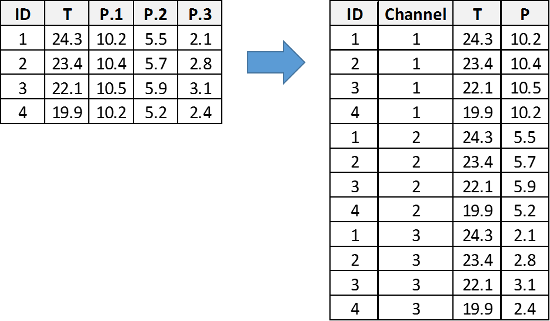

<style type="text/css">
#content {
    max-width: 1500px !important;
/*    !margin-left: 300px !important;
*/
}
#table-of-contents {
    width: 300px !important;
}

#postamble {
  font-size: 10px;
}

pre{
  background-color: #FFFFFF;
    font-size: 12px;
}
pre:not([class]) {
  background-color: #D8D8D8;
    color: black;
}

</style>

```{r global_options, include=FALSE}
knitr::opts_chunk$set(tidy=FALSE, 
  fig.show = 'hold', 
  fig.align = "center", 
  warning = FALSE, 
  message = FALSE, 
  comment = '')
options(width = 300, scipen = 9999)

# last dev version is needed for rmdformats.
# fixed these two
# more info https://github.com/juba/rmdformats/issues/92 
# more info https://github.com/juba/rmdformats/issues/93
# devtools::install_github("juba/rmdformats")

```

# What we are going to do in this LAB

1. Get the data ready for CJ Analysis 
    - Descriptives
    - From Wide to Long
2. Perform the analysis in R
    - AMCE using cjoint
    - AMCE using cregg
3. Plotting 
    - Cregg and ggplot
    - Fine tuning
4. Diagnostics 
    - Frequencies 
    - Constrains 
    - Carry over 
    - Fatigue

## Dataset used 

1. 2019 CEU Experimental Political Science dataset
  1. Q578 Q579 Q580: Choice CJ Task 
  2. F-\*-\*: Conjoint features 
  3. Q78: Employment status
  4. Q77: Race 
  5. Q76: Education 
  6. Q75: Gender 
  7. Q74: Age 
  8. Q581: Religiosity


# Environment preparation 


```{r, echo=T, message=FALSE, warning=FALSE,cache=F}

# ### Data import ###
# install.packages("readr")     # read datasets
# install.packages("qualtRics") # read qualtrics datasets
# ### Data manipulation ###
# install.packages("dplyr")     # pipes and data manipulation
# ### Visualization ###
# install.packages("ggplot2")    # graphing capabilities
# ### Estimation ###
# install.packages("cjoint")    # base amce package
# install.packages("cregg")     # amce and mm 
# install.packages("factorEx")  # amce with non-uniform distribution

## Custom build functions 
# library(devtools)
# devtools::install_github("albertostefanelli/cjoint") # fixes some problem with cjoint

### Data import ###
library("readr")     
library("qualtRics") 
### Data manipulation ###
library("dplyr")     
### Visualization ###
library("ggplot2")    
### Estimation ###
library("cjoint")   
library("cregg")     
library("factorEx")  


```


# Load the data: Non-Qualtrics data 

```{r, echo=T, message=FALSE, warning=FALSE}

df_base <- readr::read_csv("https://github.com/albertostefanelli/conjoint_class/raw/master/data/experimental_political_science_2019_cleaned.csv")

head(df_base)

```


## Get the data in the right format 

- Transform the DV in numeric format. 
  - This is required by the read.df.qualtRics() function 
- Recode the moderators if you plan to use them in the analysis 
  - We are going to use education as moderator
  - I am interesting in comparing respondents with high and low levels of education

```{r, echo=T, message=FALSE, warning=FALSE}
df_base$Q578 <- as.numeric(as.factor(df_base$Q578))
df_base$Q579 <- as.numeric(as.factor(df_base$Q579))
df_base$Q580 <- as.numeric(as.factor(df_base$Q580))

df_base$education_recoded <- ifelse(df_base$Q76=="Bachelor degree"| df_base$Q76=="PhD, JD, MD"| df_base$Q76=="Master degree", "Higher Education", "Lower Education")

df_base$education_recoded <- as.factor(df_base$education_recoded)

```

- Let's take a look at the recoded data 
- Everything seems in order 

```{r, echo=T, message=FALSE, warning=FALSE}
psych::describe(with(df_base, cbind(Q578,Q579,Q580,education_recoded)))

```

## From wide to long 

- We need to use a "staked" design because we have respondents answering multiple CJ task 

```{r ,echo=FALSE, out.width="80%",fig.cap="Conjointsdt Attributes and Levels",fig.show='hold',fig.align='centre'}


```

- We are going to achieve this using the custom made function read.df.qualtRics()
- Four arguments
  - data frame 
  - responses: the choice task variables 
  - covariates: the moderators 
  - respondentID: the respondent unique identifier

```{r, echo=T, message=FALSE, warning=FALSE}

df_long_format <- cjoint::read.df.qualtRics(df_base, 
  # the DV for our conjoint tasks (Candidate 1 and Candidate 2)
  responses=c("Q578","Q579","Q580"), 
  covariates=c("Q76"),
  respondentID = "ResponseId"
  )

head(df_long_format)


```

- The read.df.qualtRics transforms the textual information inside the CJ cells into factors with N levels 
- Relevant attributes of the read.df.qualtRics function: 
  - selected: Our DV. If the profile was selected or not (in this case: Q578,Q579,Q580)
  - respondent: unique ID
  - task: which task the respondent is performing (cognitive fatigue)
  - .rowpos: position in the CJ table row of the attribute (ordering effect)
  - profile: which profile we are referring to (left-right carry over)
  - a set of factors that will be our IVs

- Let's see how it looks for respondent 1 in our DF 

```{r, echo=T, message=FALSE, warning=FALSE}
# let's order according to the respondent ID
respondent_1 <- df_long_format[order(df_long_format$respondent),]
# let's check respondent 1 
respondent_1[1:6,]


```

# Estimating the AMCE 

## AMCE: cjoint non-interactive effects (main effect)

- The baseline AMCE represent the averaged effect of **varying** one attributes on the probability that a profile is chosen by a respondent, marginalizing over all the other attributes 
- Again: It is NOT a descriptive measures BUT a casual estimand     

```{r, echo=T, message=FALSE, warning=FALSE}

fit_1 <- cjoint::amce(selected ~ Past.Political.Experience + Penal.proceedings + Policy.Proposal,
  data=df_long_format,
  cluster=TRUE, 
  respondent.id="ResponseId"
)

summary(fit_1)

```


## AMCE: cjoint Changing baseline 

In certain cases, the used baselines are not meaningful and, thus, should be changed. For instance, in this case the baseline for political experiments is an average category (Approximately 10 years). However, i am more interested in understanding whether there is an linear effect of political experience on the probability of selecting a profile. The same goes for the attribute Policy Proposal. In this case, we want to estimate the effect of the other two attributes using as a baselien the level "Welcome immigrants and organise human corridor".


```{r, echo=T, message=FALSE, warning=FALSE}

# Change the baseline for "Education"
baselines <- list()
baselines$Past.Political.Experience <- "None"
baselines$Policy.Proposal <- "Welcome immigrants and organise human corridor"

fit_2 <- cjoint::amce(selected ~ Past.Political.Experience + Penal.proceedings + Policy.Proposal,
  data=df_long_format,
  cluster=TRUE, 
  respondent.id="ResponseId",
  baselines=baselines
)

summary(fit_2)

```

## AMCE: cregg 

```{r, echo=T, message=FALSE, warning=FALSE}

# Change the baseline for "Education"
df_long_format$Past.Political.Experience <- relevel(df_long_format$Past.Political.Experience, ref="None")
df_long_format$Policy.Proposal <- relevel(df_long_format$Policy.Proposal, ref="Welcome immigrants and organise human corridor")

fit_3 <- cregg::cj(df_long_format, selected ~ 
  Past.Political.Experience +
  Penal.proceedings+
  Policy.Proposal, 
  estimate = "amce",
  id = ~ResponseId)


fit_3

```

# Plotting: cregg and ggplot


```{r, echo=T, message=FALSE, warning=FALSE}
plot(fit_3) +  
    theme(text = element_text(size=21)) + 
    theme(legend.position = "none")


```
## Tuning ggplot

- Depending on the review where you are publishing they may ask you to change colours 
- A HUGE repository for colours https://cran.r-project.org/web/packages/ggsci/vignettes/ggsci.html

```{r, echo=T, message=FALSE, warning=FALSE}
plot_to_change <- plot(fit_3)

plot_to_change + scale_colour_grey(start = 0, end = .5) +
  theme_bw() + theme(text = element_text(size=18)) + 
    theme(legend.position = "none")
```

- We should get rid of points in the attributes 
- Past.Political.Experience -> Political Experience  

```{r, echo=T, message=FALSE, warning=FALSE}
plot_to_change <- plot(fit_3)

plot_to_change + scale_y_discrete(labels=rev(c(
    "Attribute: Past Political Experience",
    "20 years",
    "10 years",
    "Ref: None", 
    "Attribute: Penal Proceeding",
    "Investigation for corruption",
    "Convicted for corruption",
    "Ref: No Proceedings", 
    "Attribute: Policy on immigration", 
    "Expulsion of Immigrants",
    "Conditional Acceptance",
    "Ref: Unconditional Acceptance"))) + 
    theme(text = element_text(size=21)) +
    scale_colour_grey(start = 0, end = .5)  + 
    theme(legend.position = "none")
```

# Diagnostic 

## Display Frequencies and Proportions

This is especially useful if you have marginal distributions of the attributes that are not uniform 

```{r, echo=T, message=FALSE, warning=FALSE}

plot(cregg::cj_freqs(df_long_format, selected ~ 
  Past.Political.Experience +
  Penal.proceedings+
  Policy.Proposal, 
  estimate = "amce",
  id = ~ResponseId)) + 
    theme(text = element_text(size=21))


```

## Carryover and Left/Right Diagnostics

- The distribution should be at random 
- Meaning around .5 per each cell 

```{r, echo=T, message=FALSE, warning=FALSE}
# the function requires the by variable to be a factor
df_long_format$profile <-  as.factor(df_long_format$profile)

plot(cregg::cj(df_long_format, selected ~ 
  Past.Political.Experience +
  Penal.proceedings+
  Policy.Proposal, 
  id = ~ResponseId,
  by = ~profile,
  estimate = "mm"), 
  group = "profile", vline = 0.5) + 
  theme(text = element_text(size=21))

```

## Respondent's fatigue 

Let's now take a look at the effect of task on selecting a profile. We might expect that people got tired with the progression of the experiment and as such, we would see an effect of task numbering on their response behaviour. Again, we want the coefficients to overlap to have no significant different between tasks.

- We should not be able to detect any effect of the row position on our DV
- Let's test Age
- You should do it for all the attribute

```{r, echo=T, message=FALSE, warning=FALSE}

df_long_format$Penal.proceedings.rowpos <-  as.factor(df_long_format$Penal.proceedings.rowpos)

plot(cregg::cj(df_long_format, selected ~ 
  Past.Political.Experience +
  Penal.proceedings+
  Policy.Proposal, 
  id = ~ResponseId,
  by = ~Penal.proceedings.rowpos,
  estimate = "mm"), 
    group = "Penal.proceedings.rowpos", 
    vline = 0.5)+ 
theme(text = element_text(size=21))

```

```{r, echo=T, message=FALSE, warning=FALSE}

df_long_format$Past.Political.Experience.rowpos <-  as.factor(df_long_format$Past.Political.Experience.rowpos)

plot(cregg::cj(df_long_format, selected ~ 
  Past.Political.Experience +
  Penal.proceedings+
  Policy.Proposal, 
  id = ~ResponseId,
  by = ~Past.Political.Experience.rowpos,
  estimate = "mm"), 
    group = "Past.Political.Experience.rowpos", 
    vline = 0.5)+ 
theme(text = element_text(size=21))

```

# References {.allowframebreaks} 
