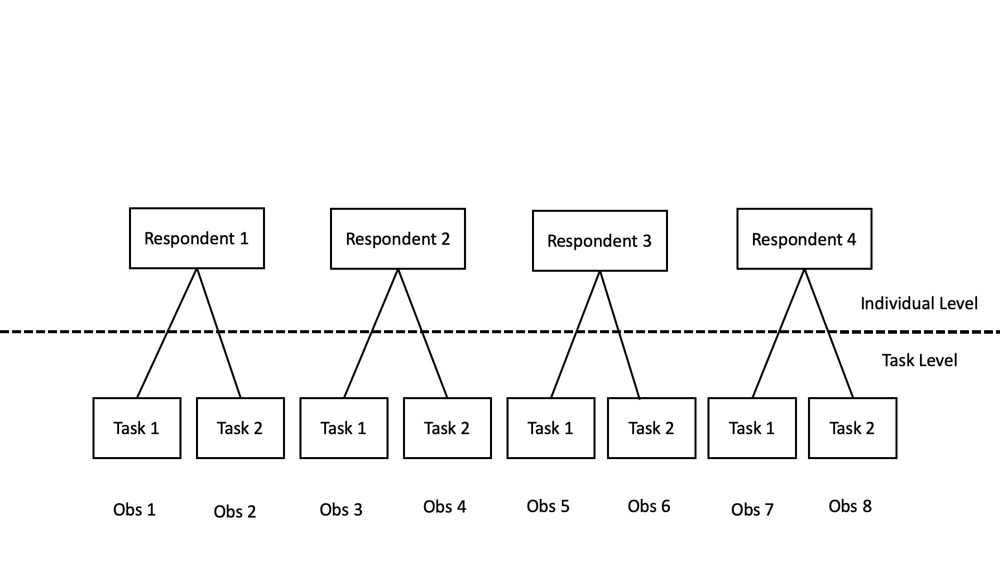

    
## Session 3: Recap  

1. Different CJ Randomization
    - Fully randomized uniform design
    - Randomized weighted design
    - Restricted Randomization (or nested design)
2. Assumptions
    - SUTVA
    - No profile-order effects
    - Randomization of the profiles 
3. Designing a survey 
    - Designing good questions
    - Response options and placement
    - Motivate respondents 
    - Get feedback and pre-test 
4. On-line Data Collection
    - Advantages/Disadvantages
    - Solutions (attention checks, IP checks, incentives)
    
    
## Session 4: Outline  

1. AMCE 
    - Effect decomposition
    - Advantages
    - Calculation
    - Interpretation 
2. Marginal Means
    - Purpose and interpretation 
    - Relation with the AMCE 

## Materials

- Lecture's PDF
- Lab
- Exercise
- Solutions

Where to find the material:

- On my [GitHub/conjoint_class](https://albertostefanelli.github.io/conjoint_class/)

## Before starting

- Make sure you install R and R Studio.
- **If you have questions, shoot : )**    


# Analysing a CJ data

## In General

1. Conjoint analysis belongs to the part-worth model family 
2. The aim is NOT to estimate the Average Treatment Effect (ATE)
3. BUT analyse the impact that each treatment/feature/attribute has on the likelihood to select a certain profile 

## Models   

1. Binomial distributions (2 profiles with discrete choice)
    1. Nested Logit
    3. **Average Marginal Component Effect AMCE** [@hainmueller_causal_2014]
    4. Marginal Means
2. Gaussian distribution (1 or 2 profiles with ratings)
    1. Nested OLS
    2. **Average Marginal Component Effect AMCE** [@hainmueller_causal_2014]
    3. Marginal Means
3. Multinomial distribution (more than 2 profiles)
    1. Nested multinomial logit
    2. Mixed multinomial Logit Model 

# Effect decomposition using the AMCE 

1. Used in most applications of conjoint survey experiments that follow @hainmueller_causal_2014
2. **Formally:** The effect of a particular attribute value of interest against another value of the same attribute while holding equal the joint distribution of the other attributes
3. **Layman terms:** A measure of the overall effect of an attribute after taking into account the possible effects of the other attributes by averaging over effect variations caused by them
4. **E.g.,** The average causal effect of being a female candidate as opposed to a male candidate on the respondents’ candidate ratings when they are also given information about the candidates’ age, race/ethnicity. 

# Advantages of the AMCE

1. Fully non parametric (in most of its applications)
2. Does not require a particular behavioural model for respondents’ decision-making processes 
3. Respondents might be maximizing utility, be boundedly rational, they might use weighted adding, lexicographic, or satisficing decision strategies and the AMCE is still valid

## How does this work ?

1. Simple Mean difference 
    1. Calculate the average rating (or probability to be chosen) for all the profile that have the same value on that particular level (e.g., all female candidates)
    2. Calculate the average rating (or probability to be chosen) for all the profile that have the same value on that particular level (e.g., all male candidates)
    3. Take the difference between the two averages 
2. AMCE averages over both the sign and the magnitude of the individual-level causal effects
3. All the attributes but the one of interest are treated as pre-treatment covariates and averaged over 


## A numerical Example 

1. Toy example 
    1. 5 Voters
    2. 6 Tasks 
    1. 2 Profiles 
    1. Forced choice 
2. Attributes and Levels 
    1. Gender: Female, Male 
    2. Party: Republican, Democrat 
2. Every possible pairwise comparison
3. Votes a candidate would obtain in a head to head competition

## Calculations AMCE for Male Candidates

1. Count how many times a candidate would have won in a head to head competition
2. Per each competition, compare how male candidates perform against female 
3. Calculate the fraction of vote for male VS female candidates 
3. Sum over all possible opponents (i.e. tasks)
4. Normalize by (# of profiles - 1) X (# of features -1) X # of values of gender 

## A numerical Example: Table  

1. Votes that each candidate would take for every possible pairwise comparison 
2. Men win 3 out of 4 election when they face a woman and 4 out of 6 total contests
3. For instance, for the comparison *Male Republican VS Female Republican*, male candidates win 3 times, female candidates win 2 times 


```{r ,echo=FALSE,message=FALSE}
library(dplyr)
library(kableExtra)
```


```{r, echo=FALSE, out.width="80%",fig.cap="",fig.show='hold',fig.align='centre'}

df <- data.frame(Comparison=c("MR,FR","MR,FD","MR,MD","MD,FR", "MD,FD","FR,FD"),
Voter_1=c("MR","MR","MR","FR","MD","FR"),
Voter_2=c("MR","MR","MR","FR","MD","FR"),
Voter_3=c("MR","MR","MR","FR","MD","FR"),
Voter_4=c("FR","FD","MD","FR","FD","FD"),
Voter_5=c("FR","FR","FR","FR","FD","FD"),
"Sum Tally"=c("3,2","3,2","3,2","0,5","3,2","0,5")
)

names(df) <- c("Comparison", "Voter 1", "Voter 2", "Voter 3", "Voter 4", "Voter 5", "Sum Tally")

kable(df, "latex", booktabs=FALSE, escape=T,linesep="") %>%
    kable_styling(position = "center") %>%
    kable_styling(c("condensed"), latex_options="scale_down", full_width = F)

```

## Calculation table (1)

```{r ,echo=FALSE, out.width="80%",fig.cap="Conjointsdt Attributes and Levels",fig.show='hold',fig.align='centre'}

df <- data.frame(
Profile_1=c("Y(MR,MD)","Y(MR,FD)","Y(MR,MR)","Y(MR,FR)","Y(MD,MD)","Y(MD,FD)","Y(MD,MR)", "Y(MD,FR)"),
Profile_2=c("Y(FR,MD)","Y(FR,FD)","Y(FR,MR)","Y(FR,FR)","Y(FD,MD)","Y(FD,FD)","Y(FD,MR)", "Y(FD,FR)"))

names(df) <-c("Profile 1", "Profile 2")

kable(df, "latex", booktabs=FALSE, escape=T,linesep="") %>%
     kable_styling(position = "center") %>%
     kable_styling(font_size = 9) 

```

## Calculation table (2)

```{r ,echo=FALSE, message=FALSE,out.width="80%",fig.cap="",fig.show='hold',fig.align='centre'}


df <- data.frame(
Profile_1=c("Y(MR,MD)","Y(MR,FD)","Y(MR,MR)","Y(MR,FR)","Y(MD,MD)","Y(MD,FD)","Y(MD,MR)", "Y(MD,FR)"),
Profile_2=c("Y(FR,MD)","Y(FR,FD)","Y(FR,MR)","Y(FR,FR)","Y(FD,MD)","Y(FD,FD)","Y(FD,MR)", "Y(FD,FR)"),
Male=c("3/5","3/5","5/10","3/5","5/10","3/5","2/5","0/5"),
Female=c("5/5","5/5","2/5","5/10","2/5","5/10","2/5","5/5"),
"Subtraction (Male - Female)" =c("-2/5","-2/5","1/10","1/10","1/10","1/10","0","-5/5")
)

df[] <- lapply(df, as.character)

df <- rbind(df,c("Sum","","","","-14/10"))

names(df)[1] <- "Profile 1"
names(df)[2] <- "Profile 2"
names(df)[5] <- "Male - Female"


kable(df, "latex", booktabs=FALSE, escape=T, linesep="") %>%
    kable_styling(position = "center") %>%
    kable_styling(c("condensed"), latex_options="scale_down", full_width = F)%>%
    kable_styling(font_size = 9)

```

## Calculation AMCE (1)

Let's calculate the normalization constant 

$$
\begin{aligned}
           &= (profile - 1) \cdot (features -1) \cdot gender \\
           &= (2-1) \cdot (4-1) \cdot 2 \\
           &= 1 \cdot 3 \cdot 2 \\
           &= 6
\end{aligned}
$$

## Calculation AMCE (2)

Let's now use plug in the normalization constant into the AMCE formula  obtained from the sum over all possible opponents 

$$
\begin{aligned}
AMCE&= - \frac{14}{10}/2 \\
    &= -\frac{7}{5}/6 \\
    &= -\frac{7}{5}\cdot \frac{1}{6} \\
    &= -\frac{7}{30} \\
    &= -0.24
\end{aligned}
$$

## What the AMCE really is

1. **Interpretation:** The average effect of varying one attributes of a profile on the probability that that profile will be chosen by a respondent
2. **Interpretation:** Shifting a candidate's gender from Male to Female increase the favourability (or likelihood of choosing a candidate) by X percentage points  
2. The range of value depends on the number of level of a feature and the probability of co-occurrence of the same attribute levels (Female Candidate VS Female Candidate)
    1. With 5 levels $(1/5)-1=0.8$ and thus the bound is -0.8 to 0.8
    2. Q: What about gender: Female and Male? 
3. Take home message: 
    1. **CAUTION in comparing the relative size of features with different levels !!!**
    2. As in any regression, the AMCE is a relative quantity. Favourability is higher or lower **relative to the attribute baseline**. 

## What the AMCE is NOT 

1. **NOT** a general measure of preference of certain attributes
    - **NOT** interpretable as the majority of the respondents prefer a profile with feature A versus candidate with feature B
    - **NOT** interpretable as that respondents prefers candidate with feature A versus candidate with feature B 
    - **NOT** definable on the collapsed joint distribution (cross tab) of the preferences. It is defined on a collection of all two-way comparisons. 
2. **NOT** that candidates with feature A beat candidates with feature B in most elections
3. Example: 
    1. A large majority of the respondents can have a preference for female candidates but the AMCE is positive for male candidates 
    2. Q: Why?

## Clustering structure 

1. In the above example, each respondent perform 6 pairwise comparisons 
2. So we have more observations than respondents  
3. Q: What are the units of analysis in a CJ? 

## Clustering structure 

1. In the above example, each respondent perform 6 pairwise comparisons 
2. So we have more observations than respondents  
3. Q: What are the units of analysis in a CJ?  
4. A: The units of analysis are the CJ tasks **NOT** the respondents  
5. Recall that: 
    1. DV: Choice Profile A VS Profile B  
    2. IV: Profile Attributes 
6. In order to correctly estimate the standard errors we need to take into account the clustered nature of the data 

## Clustering structure: Conjoint Data 

```{r ,echo=FALSE, out.width="80%",fig.cap="Conjointsdt Attributes and Levels",fig.show='hold',fig.align='centre'}


```

## Clustering structure: Modelling Approaches

1. **Sandwich estimators** (also called robust variance estimator)
    1. OLS: residuals variance is assumed to be independent
    1. OLS: Meaning residual variance is constant across observations 
    2. CJ: Due to the nested structure, the variance can vary between individuals.
    3. OLS for CJ: P-values for hypothesis tests and confidence intervals do not perform as they should
    3. Sandwich estimator: Take into account the variance heterogeneity
2. Choice Models with nested structure
2. Multilevel models 
    1. Level 1: CJ tasks 
    2. Level 2: Individuals
3. Bootstrapping 

## Marginal Means (1)

1. Most published research use AMCEs for descriptive purposes
    - i.e., to map variation in formability toward a multidimensional object across its various features.
    - e.g., "support for Evangelical Protestants is also 0.04 percentage points lower (SE = 0.02) than the baseline"  [@hainmueller_causal_2014, p.19]
3. AMCEs are relative, not absolute, statements about preferences
4. Use of AMCEs when performing sub-group analysis is problematic (vedi next lecture)
5. **Take home message**: use AMCEs when you are interested in description rather than casual inference. 

## Marginal Means (2)

1. MMs: describe the level of favorability toward profiles that have a particular feature level, marginalizing across all other features.
2. IN forced-choice design with two alternatives, marginal means have a direct interpretation as probabilities
    - MM=0 indicates respondents select profiles with that feature level with probability $Pr(Y = 1|X = x) = 0$
    - MM=1 indicates respondents select profiles with that feature level with probability $(P r(Y = 1|X = x) = 1$
3. With rating scale outcomes MM vary depending on the used scale 
4. For fully randomized designs, the AMCE is equal to the MM
    - e.g. $AMCE=0.09$ (9-percentage point) = $MM_1= .46 - MM_2= 0.54$

## Session 4: Recap   

1. AMCE 
    - Effect decomposition
    - Advantages
    - Calculation
    - Interpretation 
2. Marginal Means
    - Purpose and interpretation 
    - Relation with the AMCE 


## References {.allowframebreaks} 

