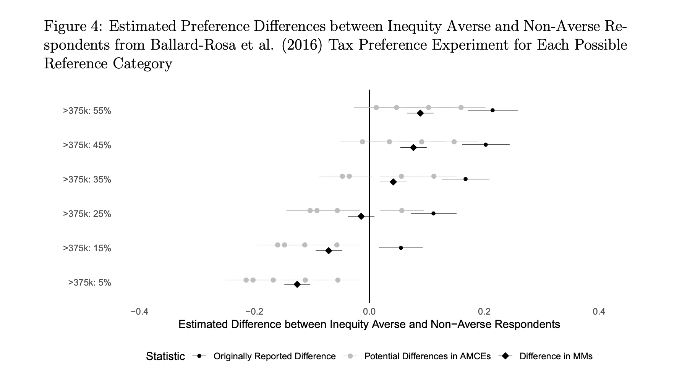

    
## Session 4: Recap   

1. AMCE 
    - Effect decomposition
    - Advantages
    - Calculation
    - Interpretation 
2. Marginal Means
    - Purpose and interpretation 
    - Relation with the AMCE 

## Session 5: Outline  

1. Sub-group analysis 
2. Attributes interaction
3. Power Analysis for CJ 
4. Restricted Randomization 
5. Weighted Randomization 
6. Conjoint mixture model

## Materials

- Lecture's PDF
- Lab
- Exercise
- Solutions

Where to find the material:

- On my [GitHub/conjoint_class](https://albertostefanelli.github.io/conjoint_class/)

## Before starting

- For credit purposes, you need to send in a take-home task. 
    - Option 1: Design a conjoint using the Conjointsdt tool and deploy it on Qualtrics 
    - Option 2: If you have collected CJ data, analyse the data, interpret them and create a report  
    - Grading: PASS/FAIL
    - **Deadline:** 07/06 (in 2 weeks)
- Make sure to install R and R Studio.
- **If you have questions, shoot : )**    

## Sub-group analysis 

1. Subgroup analyses of conjoint experiments in order to discover preference heterogeneity. 
2. Increasingly common feature of experimental analysis 
3. e.g., Features of male and female political candidates among male and female respondents [@teele_ties_2018]
4. **Technically:** Attribute’s marginal effect conditional on the respondent characteristic of interest
5. 2 quantities of interest 
    - Causal effects of profile features within each subgroup (Hainmueller et al. term "conditional AMCEs")
    - Difference between two conditional AMCEs across subgroups 
    
## Common issues in sub-group analysis (1)

1. Most of the time, difference-in-AMCEs is interpreted descriptively and not causally
    - Difference-in-AMCEs are used to descriptively interpret apparent differences in favorability toward objects with a given feature (e.g., immigrants from Syria) between the two groups (low and high ethnocentrism respondents)
    - However, differences-in-preferences (that is to say, the difference in degree of favorability toward profiles containing a given feature) are not directly reflected in differences-in-AMCEs.
    - That is, differences in AMCEs do not provide inference into difference between subgroups’ favorability toward a conjoint feature
    
## Common issues in sub-group analysis (2)

2. Reason: difference between subgroups (low and high ethnocentrism respondents) diverge in the reference category [@leeper_measuring_2019]
    - Smaller/Larger effect in difference in the AMCE for a given feature because a group has already a weak/strong preference for a given attribute
    - Lack of differences when another (meaningful) baseline category is chosen
    - AMCE difference is valid only when preferences toward profiles with the reference category are equivalent across groups.    
    - E.g. Political Experience (No Experience, 3 Years, 6 years) X PID (Republican, Democrats): Republican might experience a small effect because their preference towards candidate experience is already very high and ash such, a large positive effect for Democrats occurs despite Democrat being less supportive in every experimental conditions
3. **Take Home:** Differences in the size of causal effects should not be interpreted as differences in preferences


## Solutions for common issues in sub-group analysis 

1. Unadjusted marginal means
    - AMCE is very sensitive to which reference category you choose (as we have seen in Lab 4?) but MM are not
    - They express favorability on the scale of the outcome over alternative values of each feature
2. An omnibus F-test, measuring differences therein.
    - **Model 1**: Model estimating only marginal effects of a given attribute
    - **Model 2**: Same as Model 1 with additional interactions between the sub-grouping covariate and the features
    - F-test for the model comparison between two models 
3. Other approaches? Check out @ratkovic_sparse_2017 on Bayesian Lasso for sparse estimation and uncertainty of subgroup Analysis


## Marginal Means: comparison with AMCE

```{r ,echo=FALSE, out.width="100%",fig.cap="Conjointsdt Attributes and Levels",fig.show='hold',fig.align='centre'}


```


## Interactions between Attributes 

1. The decision of choosing a particular profile could be the results of a particular combination of features.
2. The causal effect of one attribute (say candidate’s income) may vary depending on what value another attribute (e.g., ideology) is held at. 
3. We may want to quantify the magnitude of such interactions. 
4. ACIE: Average component interaction effect
5. ACIE: Difference in the AMCEs of a given attribute between conditional on another attribute

## Interactions between Attributes: an example 

1. Voters might value the **programmatic coherence** of a candidate policy positions
    2. A voter might be in favour of a reduction of governmental intervention in the economy and as such would support a candidate in favour of cutting health care spending 
    3. What would happen if a candidate is in favour of increasing social spending but -- at the same time -- is pro Medicare?
    5. ACIE: the percentage point difference in the AMCEs of cutting social spending between a pro Medicare candidate and a candidate against it 
4. Q: Can you came up with another example of attribute interaction? (**think theoretically!**)

## AMCE with Restricted Randomization

1. Restricted randomization means that we have constrains between profile features
2. E.g., Doctor without an academic education 
3. AMCE is a weighted average across each combinations of the constrained features 
4. The effect of being a doctor on candidate favourability is marginalized **only** across higher level of educations 
5. Recommendations 
    - Check the frequencies to be sure that the conditional probability between two attributes/levels is actually 0 
    - Analysing only the complete and comparable subset of the design. To need to be implemented while analysing the CJ in R
    - Be clear about what features are being marginalized over

## Non-uniform distribution 

1. The actual distribution of profiles in the real world and the distribution of theoretical interest are often far from being uniform.
2. We should match the real world distribution 
3. It compromise the external validity of conjoint analysis.
    1. Design-based confirmatory analysis, incorporates the target profile distribution in the design 
    2. Model-based exploratory analysis, takes into account the target profile distribution at the analysis stage, after randomizing profiles and collecting data
4. Paper to read: Improving the External Validity of Conjoint Analysis: The Essential Role of Profile Distribution Brandon [@de_la_cuesta_improving_2022]

## Assumptions design with non-uniform distribution 


```{r ,echo=FALSE, out.width="100%",fig.cap="",fig.show='hold',fig.align='centre'}


```

## Non-uniform distribution example 

```{r ,echo=FALSE, out.width="100%",fig.cap="",fig.show='hold',fig.align='centre'}


```

## Power Analysis for conjoint experiments

1. Experiments must ensure that statistical power will be reasonably high
    - Successfully rejecting the null hypothesis when it is false (Type II error)
    - Reduce the rate of false-positives or exaggerated findings (Type I error)
    - You might have a coefficients that point out in the hypothesised direction but they are non-significant due to a small sample size
2. Calculating the required minimal sample size for a conjoint experiment is not a trivial exercise.
    - Multiple profiles
    - Multiple tasks
    - High numbers of attributes
    - High numbers of levels 
3. Scholars think that conjoint designs “free us from the power constraints that limit traditional factorial experiments” [@kertzer_how_2019, p.7]
    - This results in conjoint studies that are under-powered and thus are likely to result in biased estimates, both in terms of direction and magnitude

## Retrospective statistical power, Type M and Type S error rates.

- Stefanelli, A., & Lukac, M. (2020, November 18). Subjects, Trials, and Levels: Statistical Power in Conjoint Experiments. https://doi.org/10.31235/osf.io/spkcy

```{r ,echo=FALSE, out.width="100%",fig.cap="",fig.show='hold',fig.align='centre'}


```

## Power calculation tool 

- [Shiny App for power calculations in CJ](https://mblukac.shinyapps.io/conjoints-power-shiny/)
- https://mblukac.shinyapps.io/conjoints-power-shiny/


```{r ,echo=FALSE, out.width="100%",fig.cap="",fig.show='hold',fig.align='centre'}


```

## Mixture Modelling for cojoint data: Limitation of the AMCE

1. The AMCE cam swayed both by **intensity** as well as **prevalence** of some preferences (Abramson et al., 2019). 
2. Existence of subgroups with distinct preferences and different responses to the treatment.
3. Existence of unobserved subgroups with extreme preferences and their prevalence in one of the group can seriously bias the results of a conjoint experiment
4. Presence of heterogeneity within observed subgroups and not only between subgroups (i.e. strong VS weak party identifiers).

## Mixture Modelling for cojoint data: Rationale

1. We should first investigate the heterogeneity itself and then try to
explain where it comes from.
    - Subgroups as unobserved (latent) classes in the population.
    - Investigate differences in the effects between unobserved groups.
    - The effects of the attributes are allowed to differ in magnitude or direction across the extracted unobserved groups.

## Mixture Modelling for cojoint data: Equation

```{r ,echo=FALSE, out.width="100%",fig.cap="",fig.show='hold',fig.align='centre'}


```

## Mixture Modelling for cojoint data: advantages 

1. Subgroups are allowed to emerge even if they are not correlated to observed covariates.
2. Well-defined framework to test the presence of subgroups
3. Misclassification of the subjects within the unobserved subgroups can be investigated and taken into account


## Session 5: Recap   

1. Sub-group analysis 
    - Issues 
    - Solutions (MM)
2. Attributes interaction
    - ACIE
3. Power Analysis for CJ 
    - Underpowered studies 
    - Shiny app
4. Restricted Randomization 
    - Design-based approaches 
    - Model-based approaches
5. Conjoint mixture model
    - Limitations AMCE
    - Rationale 
    - Advantages

## References {.allowframebreaks} 

